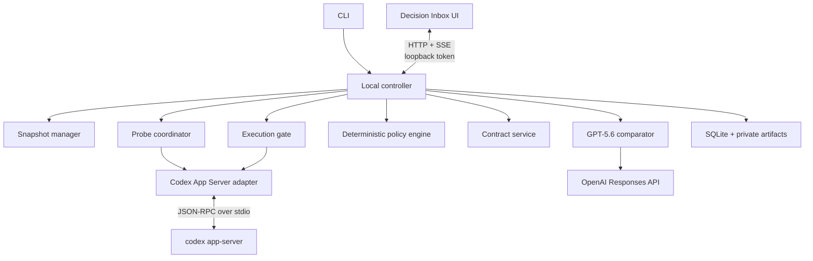

# Architecture and protocols

Status: Implementation baseline; App Server 0.144.4 probes and terminal comparison slice verified

Date: 2026-07-14

## 1. Architecture decision

Use a local TypeScript controller with two OpenAI integration paths:

1. **Codex App Server over local stdio** for repository-grounded probes, execution, streamed items, approvals, diffs, and interruption.
2. **OpenAI Responses API with GPT-5.6 Structured Outputs** for schema-constrained comparison of validated plan artifacts.

Codex App Server is preferable to scraping terminal output. Its normal generated schema exposes threads, turns, plan and file-change items, approval requests, diffs, and `turn/interrupt`. Stdio is the documented default and avoids the unsupported experimental WebSocket transport.

`codex-cli 0.144.4` still labels the umbrella app-server command and schema generators experimental. PromptTripwire therefore pins the exact CLI and canonical normal-schema hash, and treats drift as incompatible before probing. P0 does not enable the runtime experimental capability.

The Codex SDK remains a possible fallback for automation, but it is not the primary MVP integration because PromptTripwire needs deep event and approval control rather than only “start a thread and get a final response.”

Official references:

- [Codex App Server](https://learn.chatgpt.com/docs/app-server)
- [Codex SDK](https://learn.chatgpt.com/docs/codex-sdk)
- [Structured model outputs](https://developers.openai.com/api/docs/guides/structured-outputs)

## 2. Proposed technology stack

These choices describe the installed implementation baseline; browser UI dependencies remain pending.

| Area | Choice | Reason |
|---|---|---|
| Runtime | Node.js 24.15+ LTS and TypeScript | Supported LTS baseline with release-candidate `node:sqlite` available across CLI, controller, schemas, and UI. |
| CLI | Thin TypeScript executable | Primary local entry point and terminal fallback. |
| Codex integration | Spawn `codex app-server` over stdio | Documented JSON-RPC transport with rich events and approvals. |
| Comparator | Official OpenAI JavaScript SDK, Responses API, GPT-5.6 | Required Build Week model and reliable structured output. |
| Validation | Zod-derived JSON Schema | Prevent schema/type divergence. |
| Persistence | Built-in `node:sqlite` with migrations | Atomic state transitions, idempotent events, crash recovery, and no native addon. |
| Local API | Loopback-only HTTP + Server-Sent Events | Simple request/response plus one-way progress streaming. |
| UI | React + Vite | Small local decision interface; no server rendering requirement. |
| Hashing | SHA-256 over canonical JSON | Stable snapshot and contract identity. |
| Tests | Unit runner + fake JSON-RPC server + browser E2E | Covers policy logic, protocol edges, and the judge-visible flow. |

Dependency selection and lockfile changes require explicit approval at implementation time.

## 3. Component boundaries



### CLI

Parses user intent, discovers the repository, starts or connects to the controller, prints phase changes, and opens the local review URL when appropriate. It contains no policy logic.

### Snapshot manager

Inspects Git state, obtains explicit dirty-tree handling, creates temporary worktrees, calculates snapshot hashes, and verifies staleness. It must not mutate the user's checkout.

### Codex App Server adapter

Owns process lifecycle, JSON-RPC IDs, initialization, thread/turn calls, subscriptions, approval responses, interruption, protocol-version checks, and event normalization. Raw App Server payloads do not leak into domain code.

### Probe coordinator

Starts three independent threads with identical inputs and read-only policies, collects authoritative completed plan items, validates plan artifacts, applies timeout/retry behavior, and records degradation.

### GPT-5.6 comparator

Sends only task metadata and validated plan artifacts to the Responses API, requests strict Structured Outputs, handles refusals and retries, and returns an untrusted `ComparisonCandidate`.

The current adapter uses the official JavaScript SDK `responses.parse`, Zod-derived output formatting, `store: false`, no tools, and an abort signal. It validates every evidence and probe reference, rejects secret-like output before binding a content-addressed comparison identity, and records sanitized attempt/usage metadata. After two refusal/schema/timeout failures it creates an explicit unknown candidate for deterministic manual review; it never treats comparator unavailability as consensus.

### Deterministic policy engine

Normalizes model candidates, adds mandatory decisions, denies prohibited actions, suppresses non-material differences, and produces ordered decision points. It is a pure, exhaustively tested module.

### Contract service

Creates canonical immutable contracts, records human decisions, calculates hashes, invalidates stale versions, and provides matching predicates to the runtime gate.

### Execution gate

Creates a disposable worktree, launches the approved Codex turn, resolves approval requests against the contract, monitors items and diffs, interrupts deviations, and produces the actual execution report.

### Local UI service

Exposes only review/run data needed by the UI. It binds to `127.0.0.1` or `::1`, requires a high-entropy per-run capability token, uses restrictive CORS/CSP, and has no remote-listen option in the MVP.

## 4. Codex protocol use

### 4.1 Startup

1. Resolve and version-check the `codex` executable.
2. Spawn `codex app-server` with stdio pipes and a minimal environment.
3. Send `initialize` with `clientInfo.name = "prompt_tripwire"`.
4. Send `initialized`.
5. Use only methods and fields present in the normal 0.144.4 schema; never opt into `experimentalApi` for P0.
6. Refuse startup unless both `codex-cli 0.144.4` and the canonical normal-schema hash match.

The schema generator is a build/test-time compatibility tool only. `generate-json-schema` is itself labeled experimental, but its output is generated without `--experimental`, canonicalized, and compared to the pinned manifest. Runtime code validates only the small P0 protocol subset it consumes.

The build should generate or capture TypeScript/JSON schemas from the pinned Codex version and compare them in CI. Runtime messages are still validated defensively.

### 4.2 Planning threads

Each probe uses a separate `thread/start`, not `thread/fork`, to avoid shared model history. `turn/start` receives the same:

- `cwd` temporary snapshot path;
- task and planning instructions;
- model and reasoning configuration;
- read-only sandbox and network policy;
- plan-output contract.

Probe turns use `approvalPolicy: "untrusted"`. The client declines command, file-change, and permission requests outside the bounded static-inspection policy. It never uses standalone `command/exec` for probing: the 0.144.4 spike showed that read-only sandboxing prevents writes and network but does not by itself prevent all interpreter execution.

The adapter treats the final completed plan item or final structured agent output as authoritative. Deltas are for UI progress only.

### 4.3 Execution thread

Execution starts in a new thread against a new disposable worktree. It receives the approved contract as instructions plus machine-readable policy context. Human decisions are never inferred from an earlier probe conversation.

The adapter consumes at least:

- `item/started` and `item/completed`;
- plan, command-execution, file-change, MCP/app, and permission items;
- command and file-change approval requests;
- `turn/diff/updated`;
- `turn/completed`;
- error and disconnect signals.

`turn/interrupt` is issued on deviation, cancellation, timeout, stale state, or loss of policy control.

P0 handles normal-schema `item/permissions/requestApproval` fail-closed if emitted, but never proactively invokes `request_permissions`. The normal schema exposes granular approval fields while 0.144.4 runtime rejects them without the experimental capability, so granular approval and permission profiles are excluded.

Normal-schema file approval requests in 0.144.4 do not include target paths. Execution accepts one only when the same execution thread already emitted an `item/started` file-change item with the same `itemId` and every disclosed path matched the contract; an uncorrelated request is declined. Completed items, aggregate diffs, and the final Git diff are validated again, so a path that changes after approval is contained, interrupted, and reported as detected after a contained write. Required check strings are accepted only when they parse to one unambiguous argv vector and match an approved verification class; the runtime then uses sandboxed `command/exec` with network disabled and a fixed macOS system/Homebrew executable `PATH`, passes no other inherited environment, and records only the exit code, not raw output.

## 5. Structured output contracts

There are two separate schemas:

1. `PlanArtifact`: what each Codex probe intends to do.
2. `ComparisonCandidate`: what GPT-5.6 believes is consensus, disagreement, and unknown.

Both schemas are derived from the same TypeScript definitions used by domain code. Strict mode rejects extra fields. A syntactically valid model response is still untrusted content until deterministic normalization and policy evaluation complete.

The comparator receives stable evidence IDs rather than raw chain-of-thought. It returns those IDs so every decision can be traced to plan fields.

## 6. Decision ordering

The policy engine orders blocking decisions without a numeric risk score:

1. irreversible/destructive and production/shared effects;
2. permissions, secrets, authentication, billing, and network;
3. public API, persistent data, dependencies, and compatibility;
4. user-visible behavior and scope;
5. verification and rollback.

Within a category, decisions with more affected components appear first. Stable tie-breaking uses the canonical decision ID so repeat analysis does not shuffle the UI.

## 7. Enforcement model

PromptTripwire uses layered controls because no single signal can guarantee containment.

| Boundary | Preventive control | Detective/recovery control |
|---|---|---|
| Original checkout | Never use it as execution CWD | Verify Git status/hash before and after run |
| Filesystem scope | Disposable worktree + Codex sandbox + approval policy | Inspect file-change items and aggregate diff; interrupt; discard worktree |
| Commands | Contract matcher on approval request; deny unsafe classes | Record completed commands and inspect resulting diff |
| Network | Disabled by default in sandbox | Treat requests/events as deviations and interrupt |
| Remote tools | Disable unapproved MCP/apps and reject approvals | Record tool events and interrupt unexpected calls |
| Permissions | Reject requests outside contract | Persist request and decision evidence |
| Data/deploy/release | No credentials/network by default; deterministic blocker | Never report completion when an effect is unverified or unauthorized |
| Snapshot | Hash before approval and execution | Recheck at every state boundary; mark stale |

The system must distinguish “prevented,” “declined before execution,” “detected after a contained local change,” and “not observed.”

## 8. Contract matching

Matching is fail-closed.

- Paths are normalized to repository-relative POSIX form after resolving symlinks.
- `..`, absolute-path escape, case-folding ambiguity, and symlink escape are denied.
- Allowed path patterns and protected paths are evaluated with protected paths taking precedence.
- Commands are parsed from App Server action metadata when available; raw shell-string prefix matching is insufficient.
- Compound commands are split into actions and every action must be allowed.
- A command not confidently classified is denied.
- Network and remote tools use explicit host/tool/action allowlists; wildcards are not supported in P0.
- Contract changes require a new version, hash, review, and clean execution worktree.

## 9. Local API

The internal API is not public or stable in the MVP. Expected routes:

```text
GET  /api/runs/:id
GET  /api/runs/:id/events
GET  /api/runs/:id/decisions
GET  /api/runs/:id/evidence
POST /api/runs/:id/decisions/:decisionId
GET  /api/runs/:id/contracts/current
POST /api/runs/:id/contracts/approve
POST /api/runs/:id/contracts/reopen
POST /api/runs/:id/cancel
POST /api/runs/:id/deviations/:deviationId/resolve
GET  /api/runs/:id/report
```

The browser currently uses the aggregate `GET /api/runs/:id` response rather than fetching the decision and contract resources serially. Every API request, including the fetch-based SSE stream, requires the per-run bearer capability. Mutations additionally require the exact loopback Origin, JSON content type, expected run version, and an idempotency key. The server rejects a mismatched Host or run ID, returns no wildcard CORS headers, and never places the capability in a query string. The CLI supplies it once in a URL fragment; the client removes that fragment immediately after bootstrap.

The Vite build emits only same-origin React, JavaScript, and CSS assets. Content Security Policy, frame denial, MIME sniffing protection, referrer suppression, and browser capability restrictions are set on every response. Model and repository strings flow through React text rendering; model-provided HTML and remote runtime assets are not supported.

## 10. Persistence

Conceptual tables:

- `runs`
- `snapshots`
- `probe_runs`
- `plan_artifacts`
- `comparison_candidates`
- `comparator_attempts`
- `decision_points`
- `human_decisions`
- `contracts`
- `execution_runs`
- `events`
- `deviations`
- `reports`

Large sanitized artifacts are stored as user-private files referenced by content hash. Database writes for state transition, event ingestion, and approval are transactional.

The local controller uses one defensive `DatabaseSync` connection per process. Optimistic writes match the persisted run version, and each mutating retry key stores its operation, canonical request fingerprint, and original result in the same transaction as the state change. Reusing a key for different input fails closed. On startup, persisted `running` records pass through `pausing` to `paused` with `CONTROLLER_RESTART`; review, approved, paused, failed, and stale states are never auto-launched. Report and log payloads pass the deterministic sanitizer before storage, while immutable snapshots and contracts are hash-verified on both write and read.

Default roots:

```text
macOS:  ~/Library/Application Support/PromptTripwire/
Linux:  $XDG_DATA_HOME/prompt-tripwire/ or ~/.local/share/prompt-tripwire/
```

Temporary worktrees use an OS temporary directory. Their paths and cleanup outcomes are recorded. Failed cleanup is reported, not silently ignored.

## 11. Canonical identity

- Task, snapshot, decision, and contract objects are normalized before hashing.
- Hash input excludes display-only timestamps but includes all behavioral policy.
- Canonical JSON uses deterministic object-key ordering, UTF-8, and normalized line endings.
- IDs include a type prefix plus a collision-resistant digest or UUID.
- The stored content hash is recomputed before execution rather than trusted from storage.

## 12. Package layout

Proposed structure:

```text
apps/
  cli/
  controller/
  ui/
packages/
  domain/
  schemas/
  codex-app-server/
  openai-comparator/
  policy/
  git-snapshot/
  contract-runtime/
  persistence/
fixtures/
  repositories/
docs/
```

The domain and policy packages must not import UI, process-spawning, filesystem, or network modules.

## 13. Implementation sequence

1. Domain schemas, canonical hashing, state machine, and policy unit tests.
2. Fake App Server protocol harness and adapter.
3. Git snapshot/worktree containment.
4. Three real read-only Codex probes.
5. GPT-5.6 Structured Outputs comparator.
6. CLI plus terminal decision flow.
7. Local Decision Inbox UI.
8. Execution gate, deviation interruption, and clean restart.
9. Reports, retention, packaging, and judge test build.
10. End-to-end security and demo rehearsal.

This order proves the differentiated engine before spending time on visual polish.

## 14. Verified App Server constraints

The 2026-07-14 macOS/arm64 spike against `codex-cli 0.144.4` established:

- normal-schema `thread/start`, `turn/start`, `turn/interrupt`, command/file/permission requests, item lifecycle, diff, and completion methods cover the P0 adapter;
- `untrusted` command and file-change requests can be declined before execution;
- `approvalPolicy: "never"` can apply a contained file change before `turn/diff/updated`, so diff monitoring is detective;
- standalone read-only `command/exec` prevented writes/network but allowed an interpreter version command, so sandbox mode is not a command policy;
- `shell_environment_policy.inherit=none` excluded a synthetic App Server environment canary from child commands;
- granular permission approval requires the experimental capability despite appearing in the normal schema;
- duplicate events are idempotent, while completion-before-start and disconnect fixtures fail closed.

See `docs/CODEX_APP_SERVER_SPIKE.md`. Windows containment remains out of the MVP; Linux is unsupported until the same suite passes.
