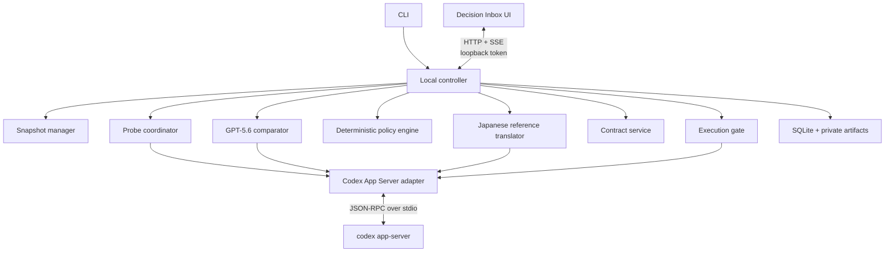

# Architecture and protocols

Status: P0 implementation baseline; unified App Server probes, comparison, and execution verified

Date: 2026-07-15

## 1. Architecture decision

Use a local TypeScript controller with one OpenAI integration path: **Codex App Server over local stdio** for repository-grounded probes, schema-constrained GPT-5.6 comparison, execution, streamed items, approvals, token usage, diffs, and interruption. App Server uses the user's existing Codex CLI login, so PromptTripwire does not add an API-key setup step or extract Codex authentication material.

Codex App Server is preferable to scraping terminal output. Its normal generated schema exposes threads, turns, plan and file-change items, approval requests, diffs, and `turn/interrupt`. Stdio is the documented default and avoids the unsupported experimental WebSocket transport.

Codex still labels the umbrella app-server command and schema generator experimental. PromptTripwire therefore does not infer compatibility from a version number. Before target-repository inspection it resolves one executable, generates its normal schema into a private temporary directory, validates the single shared compatibility profile, completes a tool-free bounded canary through the same App Server process, and attests that process. P0 never enables the runtime experimental capability.

The Codex SDK remains a possible fallback for automation, but it is not the primary MVP integration because PromptTripwire needs deep event and approval control rather than only “start a thread and get a final response.”

Official references:

- [Codex App Server](https://learn.chatgpt.com/docs/app-server)
- [Codex authentication](https://learn.chatgpt.com/docs/auth#openai-authentication)
- [OpenAI API authentication](https://developers.openai.com/api/reference/overview#authentication)
- [Codex SDK](https://learn.chatgpt.com/docs/codex-sdk)
- [Structured model outputs](https://developers.openai.com/api/docs/guides/structured-outputs)

## 2. Proposed technology stack

These choices describe the installed implementation and judge-distribution baseline.

| Area | Choice | Reason |
|---|---|---|
| Runtime | Node.js 24.15+ LTS and TypeScript | Supported LTS baseline with release-candidate `node:sqlite` available across CLI, controller, schemas, and UI. |
| CLI | Thin TypeScript executable | Primary local entry point and terminal fallback. |
| Codex integration | Spawn `codex app-server` over stdio | Documented JSON-RPC transport with rich events and approvals. |
| Comparator | Fresh tool-free Codex App Server thread, GPT-5.6 | Reuses Codex authentication and normal-schema structured output without a second credential path. |
| Validation | Zod-derived JSON Schema | Prevent schema/type divergence. |
| Persistence | Built-in `node:sqlite` with migrations | Atomic state transitions, idempotent events, crash recovery, and no native addon. |
| Local API | Loopback-only HTTP + Server-Sent Events | Simple request/response plus one-way progress streaming. |
| UI | React + Vite | Small local decision interface; no server rendering requirement. |
| Hashing | SHA-256 over canonical JSON | Stable snapshot and contract identity. |
| Tests | Unit runner + fake JSON-RPC server + browser E2E | Covers policy logic, protocol edges, and the judge-visible flow. |

Dependency selection and lockfile changes require explicit approval at implementation time.

## 3. Component boundaries



### CLI

Parses user intent, discovers the repository, starts or connects to the controller, prints phase changes, and opens the local review URL when appropriate. It contains no policy logic.

### Snapshot manager

Inspects Git state, obtains explicit dirty-tree handling, creates temporary worktrees, calculates snapshot hashes, and verifies staleness. It must not mutate the user's checkout.

### Codex App Server adapter

Owns process lifecycle, JSON-RPC IDs, initialization, thread/turn calls, subscriptions, approval responses, interruption, protocol-version checks, and event normalization. Raw App Server payloads do not leak into domain code.

### Probe coordinator

Materializes the disposable probe worktrees and performs a fail-closed canonical
symlink audit before starting any probe thread. It then starts three independent
threads with identical inputs and read-only policies, collects authoritative
completed plan items, validates plan artifacts, applies timeout/retry behavior,
and records degradation. Plan `commands` fields are instructed and
schema-described as literal shell-free argv strings only; workflow directives
and explanatory check prose belong outside that field. Malformed values are not
normalized and remain fail-closed as `unknown`. Probe instructions likewise
require bare allowlisted inspection program names; model-authored absolute or
relative executable paths and explicit shells remain unknown or unsafe rather
than being rewritten into an allowed command. A symlink-containment failure blocks the whole batch
and is not retried or reduced to a two-probe degraded result.

### GPT-5.6 comparator

Sends only task metadata and validated plan artifacts to a fresh ephemeral App Server thread, requests schema-constrained output, handles invalid output and retries, and returns an untrusted `ComparisonCandidate`.

The App Server process starts outside the target repository. Each comparison gets another empty user-only temporary directory, `ephemeral: true`, read-only sandboxing, network disabled, `untrusted` approval, no MCP/apps/subagents, and instructions prohibiting tools. Every approval request, tool item, or non-empty diff fails the comparison. The adapter uses a Zod-derived JSON Schema, validates every evidence and probe reference, rejects secret-like output before binding a content-addressed comparison identity, and records sanitized thread/turn/usage metadata. After two schema/reference/timeout failures it creates an explicit unknown candidate for deterministic manual review; it never treats comparator unavailability as consensus.

### Deterministic policy engine

Normalizes model candidates, evaluates the normalized original task as
first-class evidence alongside every validated plan, adds mandatory decisions,
denies prohibited actions, suppresses non-material differences, and produces
ordered decision points. Task-only evidence remains distinguishable and never
claims probe support. The pure, exhaustively tested module also recognizes only
whole-value, unambiguous dependency no-change declarations; contrast clauses
remain eligible for positive action matching. Contract previews identify this
behavior as `deterministic-v2`.

### Japanese reference translator

After comparison and deterministic normalization have produced the final
authoritative decision points, the controller first maps only the task and
displayable decision strings through the shared deterministic export sanitizer.
It sends that sanitized presentation source to a fresh ephemeral App Server
thread. The
thread uses the same logged-in Codex CLI, an empty user-only temporary directory,
read-only sandboxing, network disabled, `untrusted` approval, no
MCP/apps/subagents, and a strict Zod-derived output schema. Source strings are
explicitly treated as untrusted quoted data rather than instructions. Any tool
request, permission request, file change, or diff fails the translation turn.

The translation result is presentation-only. The binding layer requires the
exact original decision and option IDs plus identical decision, option, and
effect counts, rejects newly secret-like output, and normalizes ordering to the
source records. It is stored in `review_presentations` with a source hash that
excludes mutable review status. It is never passed to policy, decision normalization,
human mutation fingerprints, contract creation/hashing, execution, or reports.
A failed turn stores only a bounded error code and produces an explicit UI
fallback to the escaped sanitized source copy; it does not fail or approve the
inspection.

### Contract service

Creates canonical immutable contracts, records human decisions, calculates hashes, invalidates stale versions, and provides matching predicates to the runtime gate.

### Execution gate

Creates a disposable worktree, launches the approved Codex turn, resolves approval requests against the contract, monitors items and diffs, interrupts deviations, and produces the actual execution report.

### Local UI service

Exposes only review/run data needed by the UI. It binds to `127.0.0.1` or `::1`,
requires a high-entropy per-run capability token, uses restrictive CORS/CSP,
and has no remote-listen option in the MVP. Its listener and capability are
bounded to reviewable state: terminal/non-reviewable state, archive, or 30
minutes with neither authenticated activity nor an authenticated SSE stream
closes the server without mutating the persisted run or inferring approval.
Live issuance also advances a per-run, non-secret SQLite generation lease so a
new listener deterministically supersedes an older listener in another local
process without persisting either listener's bearer token.

The bundled React client owns a presentation-only Japanese/English dictionary.
It derives the initial locale from the browser preference, stores only the
`ja`/`en` choice in origin-scoped browser storage, and updates the document
language for assistive technology. The aggregate review API deterministically
sanitizes the complete browser DTO and returns that presentation-safe copy plus
an optional source-bound Japanese presentation. Japanese rendering labels it
as a reference translation and exposes the sanitized source task and full
decision text in expandable sections. English rendering uses the same sanitized
source copy. Canonical persistence is not rewritten. Locale state is not sent
to the controller and neither the locale nor reference presentation can alter
a decision or approval fingerprint.

### Codex Plugin adapter

`plugins/prompt-tripwire` is a distribution adapter, not another controller.
Its `preflight` Skill invokes the existing `tripwire` executable through a
small Node script with `shell: false` and terminal output. When the task is
supplied over standard input, the script forwards it to the existing CLI without
creating a file in the target checkout. The script only exposes
`inspect`, `status`, `review-url`, `run`, and `report`; approval and decision mutations remain
CLI/UI operations owned by the controller. It checks macOS arm64, its matching
runtime, and the existing Codex CLI login before delegation, and propagates a
deterministic re-entry environment flag to child PromptTripwire processes.
The Skill's `agents/openai.yaml` declares
`policy.allow_implicit_invocation: false`; Codex therefore requires an explicit
`$prompt-tripwire:preflight` mention instead of activating preflight from a
description match. The SKILL instructions repeat that restriction as defense
in depth.
Propagation is deliberately two-stage. The adapter sets
`PROMPT_TRIPWIRE_PLUGIN_REENTRY=1`; the App Server transport retains only that
non-secret sentinel in its minimal process environment and conditionally adds
`shell_environment_policy.set={PROMPT_TRIPWIRE_PLUGIN_REENTRY="1"}` so commands
spawned by App Server observe it despite
`shell_environment_policy.inherit=none`. Every launch also sets the
controller-owned isolated `ZDOTDIR`; normal non-Plugin launches add no re-entry
process-environment exception or sentinel override.

The shared App Server transport also starts with the pinned `plugins` feature
disabled before any probe, comparison, or execution thread is created. The
outer task remains byte-for-byte unchanged, but installed Plugin instructions
and bundled Skills are not contributed to the child model context. This is not
an all-Skills switch: standalone system, user, and repository Skills can remain
discoverable, and any resulting repository-external read still fails the normal
probe containment checks. The re-entry sentinel remains defense in depth. The
minimal App Server process environment may retain `CODEX_HOME` so custom local
Codex login state matches the adapter's login check; child shell commands still
inherit none of it.

The adapter itself starts an authenticated nested `codex app-server`. A
restrictive shell sandbox around the calling Codex tool command can block that
child's model-service request before PromptTripwire's own App Server policies
apply. The Skill therefore requests the caller's normal command permission to
run only the adapter outside that outer shell sandbox when necessary. This is
an outer process-launch boundary, not a PromptTripwire review or approval
boundary: the nested App Server still starts through the same transport, the
probe/comparator/executor sandbox and tool policies remain unchanged, and the
two-stage re-entry guard remains mandatory. A denied permission stops the
flow. A sandboxed `INSUFFICIENT_VALID_PROBES: request failed` symptom permits
at most one retry through the normal caller permission path.

V1 deliberately does not add hooks, MCP, a hosted service, npm distribution,
or a second runtime. The macOS archive co-distributes the adapter beside the
existing relocatable release runtime. Its optional installer mode places the
marketplace and Plugin under the versioned user-local runtime root, generates a
private pointer to that one launcher for the installed Plugin copy, and then
uses the Codex CLI's normal marketplace/plugin commands. `PATH` and
`PROMPT_TRIPWIRE_BIN` remain fallbacks for repo/Git installs. This keeps the
CLI, policy, contract, containment, and report paths as the source of truth.

## 4. Codex protocol use

### 4.1 Startup

1. Resolve the `codex` executable to a real path, hash its bytes, and record its reported version only as attestation metadata.
2. In a private mode-`0700` temporary directory disconnected from the target repository, run that exact executable's normal `generate-json-schema` command. Validate every request, notification, response, required field, type, nullability, and known enum surface consumed by the runtime against the shared machine-readable profile. Do not use a cached schema or version-specific branch.
3. Spawn that exact executable's `codex app-server` in the same private runtime root with stdio pipes, the `plugins` feature disabled, and a minimal environment; rely only on the existing Codex CLI login. Retain `CODEX_HOME` only for App Server authentication/config lookup when the caller set it. Create an empty mode-`0700` zsh startup directory under that root and always pass it as `ZDOTDIR` through `shell_environment_policy.set` while keeping `shell_environment_policy.inherit=none`. If and only if the incoming process has `PROMPT_TRIPWIRE_PLUGIN_REENTRY=1`, preserve that sentinel and add its exact child setting to the same map. Neither `CODEX_HOME` nor any general caller variable is inherited by child shell commands.
4. Send `initialize`/`initialized`, list the required model/effort, and run a bounded nonce canary in the private root with read-only sandboxing, network disabled, deny-all tool handling, and strict JSON output.
5. Re-hash and re-read the executable before accepting an attestation. The attestation contains executable realpath/digest, observed version, profile version, normalized required-surface fingerprint, canary fingerprint, and their compatibility fingerprint.
6. Only after attestation succeeds may snapshotting connect to the target repository. Inspection reuses the already verified App Server process. Approval and run each repeat the measurement and require exact attestation equality; mismatch or inability transactionally makes the run stale. Run reuses the verified process and measures before creating the execution worktree.
7. Never opt into runtime `experimentalApi`.

The normalized fingerprint includes only required consumed surfaces, so new optional fields, unused methods, and extra schema enum variants do not cause a false incompatibility. Runtime messages are still validated defensively: an unknown request cannot be answered safely and is rejected with interruption, and a newly observed enum variant is denied even if its additive schema declaration was acceptable. The bounded canary detects only the semantics it observes; same-schema semantic drift outside that behavior remains a documented residual risk.

### 4.2 Planning threads

Each probe uses a separate `thread/start`, not `thread/fork`, to avoid shared model history. `turn/start` receives the same:

- `cwd` temporary snapshot path;
- task and planning instructions;
- model and reasoning configuration;
- read-only sandbox and network policy;
- plan-output contract.

Probe turns use `approvalPolicy: "untrusted"`. The client declines command, file-change, and permission requests outside the bounded static-inspection policy. It never uses standalone `command/exec` for probing: the 0.144.4 spike showed that read-only sandboxing prevents writes and network but does not by itself prevent all interpreter execution.

Immediately before `thread/start`, the coordinator walks each materialized
worktree without following symlinked directories. Every symlink must resolve to
a canonical target under the canonical probe root; broken, external, or
unresolvable links produce `PROBE_CONTAINMENT_VIOLATION` and block all plan
artifacts for the batch. At every command approval, the adapter independently
resolves the canonical root, CWD, nearest existing ancestor, and structured
action target before accepting a static read. This per-action check covers
new/nonexistent suffixes and filesystem changes after the pre-thread audit;
shell-expanded or ambiguous CWD/path text, explicit `..` segments, and
absolute-path escape are rejected before canonical matching, and missing
canonical evidence denies the action. The adapter then tokenizes the action's
actual command without expansion, requires a single allowlisted static-read
program and bounded flags, and checks that its command operands match the
structured action type/path. For `search`, App Server 0.144.4 can reduce the
structured path to one operand's basename. That lossy representation is
accepted only when the basename uniquely identifies an explicit command
operand; every one of one or more `rg` paths is independently canonicalized and
checked for containment and protected-content reachability. Codex App Server 0.144.4 on macOS reports these
items through exact `/bin/zsh -c <structured-command>` or
`/bin/zsh -lc <structured-command>` process envelopes. The transport first sets
`ZDOTDIR` to a fresh empty mode-`0700` directory inside its disposable runtime
root so user-controlled zsh startup files are not loaded. The adapter accepts
only those three-token shapes, tokenizes the single inner command again, and
requires it to equal the structured action before applying the same command and
path policy. Root-owned global zsh startup files remain an explicit macOS host
trust assumption. Other interpreter wrappers, compound/redirection syntax,
the `-` standard-input sentinel, executable read hooks such as `rg --pre` and
symlink-following search flags such as `rg -L`/`--follow`, `find -exec`, and
semantic mismatch are denied. Direct content reads check default secret-like patterns and `.git` metadata against both
the lexical and canonical target. Before a recursive `rg`, the adapter walks its
effective target and denies the search if it can reach protected content;
hidden entries are considered reachable when the command uses `--hidden` or a
positive `--glob`/`-g` inclusion, while visible protected key/certificate paths
always block recursive content search. Negative-only globs do not broaden
hidden reachability. `listFiles` remains a names-and-metadata-only class and may
enumerate protected path names without granting content access. App Server may
emit an absolute structured action path such as `${cwd}/README.md`; it is
accepted only when canonical resolution keeps it inside the probe root.

The adapter treats the final completed plan item or final structured agent output as authoritative. Deltas are for UI progress only.

### 4.3 Comparison thread

Each comparison uses a separate `thread/start`, never a probe thread or `thread/fork`. Its CWD is a fresh empty disposable directory rather than the target repository. `turn/start` includes the exact model/effort, read-only sandbox with network disabled, no summary, and the `ComparisonCandidate` content schema. Command, file, permission, unknown server requests, tool items, and diffs are denied and fail closed. Only the final completed schema-constrained agent message is accepted. Stable `thread/tokenUsage/updated` notifications supply audit usage; thread and turn IDs, plus usage observed before failure, are persisted with each attempt. A comparison thread keeps its deny-all classification for the App Server client lifetime so a delayed request cannot inherit the planning probe's static-read policy.

### 4.4 Execution thread

Execution starts in a new thread against a new disposable worktree. It receives the approved contract as instructions plus machine-readable policy context. Human decisions are never inferred from an earlier probe conversation.

The adapter consumes at least:

- `item/started` and `item/completed`;
- plan, command-execution, file-change, MCP/app, and permission items;
- command and file-change approval requests;
- `turn/diff/updated`;
- `thread/tokenUsage/updated`;
- `turn/completed`;
- error and disconnect signals.

`turn/interrupt` is issued on deviation, cancellation, timeout, stale state, or loss of policy control.

P0 handles normal-schema `item/permissions/requestApproval` fail-closed if emitted, but never proactively invokes `request_permissions`. The normal schema exposes granular approval fields while 0.144.4 runtime rejects them without the experimental capability, so granular approval and permission profiles are excluded.

Normal-schema file approval requests in 0.144.4 do not include target paths. Execution accepts one only when the same execution thread already emitted an `item/started` file-change item with the same `itemId` and every disclosed path matched the contract; an uncorrelated request is declined. Completed items, aggregate diffs, and the final Git diff are validated again, so a path that changes after approval is contained, interrupted, and reported as detected after a contained write. Required check strings are accepted only when they parse to one unambiguous argv vector and match an approved verification class; the runtime then uses sandboxed `command/exec` with network disabled and a fixed macOS system/Homebrew executable `PATH`, passes no other inherited environment, and records only the exit code, not raw output.

## 5. Structured output contracts

There are two separate schemas:

1. `PlanArtifact`: what each Codex probe intends to do.
2. `ComparisonCandidate`: what GPT-5.6 believes is consensus, disagreement, and unknown.

Both schemas are derived from the same TypeScript definitions used by domain code. Strict mode rejects extra fields. A syntactically valid model response is still untrusted content until deterministic normalization and policy evaluation complete.

The comparator receives stable evidence IDs rather than raw chain-of-thought. Its prompt includes the exact allowlists of probe IDs and `repositoryEvidence[].id` values; field names, array indexes, paths, descriptions, and invented IDs are invalid references. The adapter still validates every returned reference rather than trusting prompt compliance, so every accepted decision can be traced to plan evidence.

## 6. Decision ordering

The policy engine orders blocking decisions without a numeric risk score:

1. irreversible/destructive and production/shared effects;
2. permissions, secrets, authentication, billing, and network;
3. public API, persistent data, dependencies, and compatibility;
4. user-visible behavior and scope;
5. verification and rollback.

Within a category, decisions with more affected components appear first. Stable tie-breaking uses the canonical decision ID so repeat analysis does not shuffle the UI.

`deterministic-v2` scans the original task with action-oriented patterns before
merging plan-derived blockers. A task trigger is stored as `task:normalized`; it
is merged with a blocker of the same trigger when plan evidence exists, but an
otherwise task-only blocker carries an empty probe-support list. This backstops
plan omission without presenting the task as independent probe consensus.
Dependency matching distinguishes positive add/install/update/upgrade/replace/
remove/change intent from whole-field no-change declarations. Exact
dependency-free, no-new-dependency, unchanged/preserved, and supported Japanese
forms are suppressed only when they contain no contrast clause. A terminal
`and`/`or` coordinator keeps an opening negation over the preceding bare
comma-separated list; without that coordinator, or after `but`, `then`, a new
subject/modal, or a new sentence, positive actions remain independently
eligible for blocking classification.

External-effect task matching is action-and-target oriented. Bounded English
and Japanese forms cover repository archive/rename, issue transfer, S3 artifact
synchronization, and Slack notification without treating those service names as
mutations on their own. Release publication requires an actionable release
verb; download/fetch/retrieve of a GitHub release artifact contributes network
evidence only, while local inspect/verify/test wording contributes neither
network nor publication evidence. Shell-free `commands` fields are tokenized
and passed through the same command-class classifier used by the policy
boundary. Ambiguous shell syntax is unknown, and actual path/config/output
operands are checked for absolute paths, parent traversal, and protected targets.

Additional bounded task rules classify repository private/internal visibility
changes and ownership transfers as `remote_write` plus `permission`, main or
default branch-protection changes as `remote_write` plus `permission`, and S3
object deletion as `destructive_data` plus `network` plus `remote_write`.
English and Japanese action-and-target forms share those categories; bare
target nouns remain non-authoritative.

Compatibility findings from independent probes are retained as one deterministic all-or-none blocker. Explicit statements that compatibility is preserved are not impacts. The grouped blocker keeps every remaining description, component, probe, and evidence reference visible; selecting it accepts the whole disclosed set and never removes the normal P0 runtime boundaries. This avoids paraphrase-amplified question counts without using model similarity to suppress a deterministic finding.

## 7. Enforcement model

PromptTripwire uses layered controls because no single signal can guarantee containment.

| Boundary | Preventive control | Detective/recovery control |
|---|---|---|
| Original checkout | Never use it as execution CWD | Verify Git status/hash before and after run |
| Filesystem scope | Disposable worktree + Codex sandbox + approval policy | Inspect file-change items and aggregate diff; interrupt; discard worktree |
| Commands | Contract matcher on approval request; deny unsafe classes | Record completed commands and inspect resulting diff |
| Network | Disabled by default in sandbox | Treat requests/events as deviations and interrupt |
| Remote tools | Disable unapproved MCP/apps and reject approvals | Record tool events and interrupt unexpected calls |
| Permissions | Reject requests outside contract | Persist request and decision evidence |
| Data/deploy/release | No credentials/network by default; deterministic blocker | Never report completion when an effect is unverified or unauthorized |
| Snapshot | Hash before approval and execution | Recheck at every state boundary; mark stale |

The system must distinguish “prevented,” “declined before execution,” “detected after a contained local change,” and “not observed.”

## 8. Contract matching

Matching is fail-closed.

- Probe worktrees pass a full pre-thread symlink audit; every link must resolve under the canonical root. Each structured static-read action then canonicalizes its root, CWD, and path independently, using the nearest existing ancestor for a nonexistent suffix.
- Paths are normalized to repository-relative POSIX form after canonical resolution. Explicit `..` segments, absolute-path escape, case-folding ambiguity, broken/unresolved links, missing resolution evidence, and canonical symlink escape are denied. A structured absolute probe-action path is permitted only when canonical resolution proves it is inside the probe root; internal symlinks are allowed only while their resolved targets remain inside the root.
- Allowed path patterns and protected paths are evaluated with protected paths taking precedence.
- Commands are parsed from App Server action metadata when available; raw shell-string prefix matching is insufficient.
- Compound commands are split into actions and every action must be allowed.
- A command not confidently classified is denied.
- Network and remote tools are deny-only in the P0 executor. The contract schema reserves explicit host/tool/action fields for a future executor; P0 neither interprets them as authority nor supports wildcards.
- Contract changes require a new version, hash, review, and clean execution worktree.

Model-divergence choices affect the enforceable local boundary. The contract contains the global intersection plus the values shared by the probes supporting each selected alternative for paths, components, assumptions, and verification commands. A free-form answer cannot expand these fields because it has no independently validated probe support.

Before creating an execution worktree, the P0 runtime rejects any contract with an allowlist network/data/dependency/external-effect policy or a high-impact command class in its allowed set. This makes the reserved schema fields inert even if a contract is created through a lower-level API instead of the normal review builder.

## 9. Local API

The internal API is not public or stable in the MVP. Expected routes:

```text
GET  /api/runs/:id
GET  /api/runs/:id/events
GET  /api/runs/:id/decisions
GET  /api/runs/:id/evidence
POST /api/runs/:id/decisions/:decisionId
GET  /api/runs/:id/contracts/current
POST /api/runs/:id/contracts/approve
POST /api/runs/:id/contracts/reopen
POST /api/runs/:id/cancel
POST /api/runs/:id/deviations/:deviationId/resolve
GET  /api/runs/:id/report
```

The browser currently uses the aggregate `GET /api/runs/:id` response rather than fetching the decision and contract resources serially. Every API request, including the fetch-based SSE stream, requires the per-run bearer capability. Mutations additionally require the exact loopback Origin, JSON content type, expected run version, and an idempotency key. The server rejects a mismatched Host or run ID, returns no wildcard CORS headers, and never places the capability in a query string. The CLI supplies it once in a URL fragment; the client removes that fragment immediately after bootstrap.

The live server polls the persisted run lifecycle while it is open. It remains
available only for `needs_review`, `ready_for_approval`, or `paused`, and closes
on any other state, archive, controller/run loss, or 30 minutes since the last
authenticated API request when no authenticated SSE response is active. Active
SSE prevents idle closure; unauthenticated requests do not refresh the timer.
Closure is idempotent, ends SSE responses, resolves the CLI wait, and revokes the
in-memory capability. It performs no decision or state mutation, so reopening a
still-reviewable run creates a fresh listener and capability rather than
recovering or inferring approval from the old one. After bind and the second
lifecycle check, live issuance atomically increments the run's persisted,
non-secret generation lease. An older process detects the mismatch on its next
authenticated request or bounded lifecycle poll, returns `410
CAPABILITY_REVOKED` when still reachable, and closes. Only the random bearer
token remains in process memory.

Live startup checks reviewability before and after loopback bind. API routing
checks the persisted boundary before serving data; mutation routes repeat that
check after reading the size-bounded body within a five-second deadline and
immediately before their synchronous controller call. Review persistence
operations invoked by the UI repeat the unarchived and current-generation checks
inside `BEGIN IMMEDIATE`, which gives archive, listener replacement, and review
mutation a deterministic database ordering even across local processes.
The final blocking answer uses one outcome transaction: it writes idempotency and
human-decision provenance, resolves the decision, creates and hash-validates the
next immutable draft contract, and transitions to `ready_for_approval`. A
`_cancel` or `_rerun` answer uses the same boundary but atomically transitions to
`cancelled` without a contract. Generation or version failure rolls back every
part of either outcome; contract approval remains a later explicit transaction.
Because that outcome is derived by the controller, it is excluded from the
client request fingerprint. A v0.1.1 final-answer idempotency key therefore
remains replayable after upgrade, while a changed decision payload still
conflicts.
Generation issuance itself changes no run, decision, contract, or approval
record. Lifecycle closure first revokes the
capability and allows only a short response grace, then closes all remaining
connections so an incomplete authenticated POST cannot keep the listener or CLI
wait alive.
SSE computes its initial event before sending headers, so concurrent run loss
returns a bounded error instead of attempting a second response.

The terminal renderer prints stable decision/option IDs and complete select, free-form, defer, and cancel commands for each visible card. It does not require a database query to translate a rendered option into a mutation.

Recorded judge replay uses the same loopback/capability controls but marks every aggregate response with `mode: "recorded"` and rejects every POST with `RECORDED_REPLAY_READ_ONLY`. Its controller state is generated in a disposable private directory from sanitized bundled values, never from a target repository. The UI shows a persistent recorded/read-only banner and disables decision, approval, and cancellation controls.

The Vite build emits only same-origin React, JavaScript, and CSS assets. Content Security Policy, frame denial, MIME sniffing protection, referrer suppression, and browser capability restrictions are set on every response. Model and repository strings flow through React text rendering; model-provided HTML and remote runtime assets are not supported.

## 10. Persistence

Conceptual tables:

- `runs`
- `snapshots`
- `probe_runs`
- `plan_artifacts`
- `comparison_candidates`
- `comparator_attempts`
- `decision_points`
- `human_decisions`
- `contracts`
- `execution_runs`
- `events`
- `deviations`
- `reports`
- `review_capability_leases`
- `review_presentations`

Large sanitized artifacts are stored as user-private files referenced by content hash. Database writes for state transition, event ingestion, decision resolution, contract creation, and approval are transactional. Final-answer resolution and its ready-or-cancel outcome share one transaction; approval does not.

`review_presentations` contains only Japanese reference text or a bounded
unavailable status. Its source hash binds task and immutable decision/option
content while excluding mutable review status. It is not a source for contract
or report construction.

The local controller uses one defensive `DatabaseSync` connection per process. Optimistic writes match the persisted run version, and each mutating retry key stores its operation, canonical request fingerprint, and original result in the same transaction as the state change. Reusing a key for different input fails closed. A non-secret per-run review generation coordinates live listeners across those connections; bearer capabilities are never stored. On startup, persisted `running` records pass through `pausing` to `paused` with `CONTROLLER_RESTART`; review, approved, paused, failed, and stale states are never auto-launched. Report and log payloads pass the deterministic sanitizer before storage, while immutable snapshots and contracts are hash-verified on both write and read.

Default roots:

```text
macOS:  ~/Library/Application Support/PromptTripwire/
Linux:  $XDG_DATA_HOME/prompt-tripwire/ or ~/.local/share/prompt-tripwire/
```

Temporary worktrees use an OS temporary directory. Their paths and cleanup outcomes are recorded. Failed cleanup is reported, not silently ignored.

## 11. Canonical identity

- Task, snapshot, decision, and contract objects are normalized before hashing.
- Hash input excludes display-only timestamps but includes all behavioral policy.
- Canonical JSON uses deterministic object-key ordering, UTF-8, and normalized line endings.
- IDs include a type prefix plus a collision-resistant digest or UUID.
- The stored content hash is recomputed before execution rather than trusted from storage.

## 12. Package layout

Proposed structure:

```text
apps/
  cli/
  controller/
  ui/
packages/
  domain/
  schemas/
  codex-app-server/
  openai-comparator/
  policy/
  git-snapshot/
  contract-runtime/
  persistence/
fixtures/
  repositories/
docs/
```

The domain and policy packages must not import UI, process-spawning, filesystem, or network modules.

The macOS arm64 release archive materializes only compiled PromptTripwire JavaScript, bundled UI assets, the four third-party runtime packages required by those outputs, and the thin Skill/marketplace adapter. Workspace symlinks, demo media, and development dependencies are not required at judge runtime. A shell launcher checks platform and Node version before starting the compiled CLI; the CLI performs measured normal-schema/handshake/canary compatibility instead of a Codex version gate. Plain `install.sh` remains runtime-only. `install.sh --with-codex-plugin` additionally verifies Git, the presence and version-output shape of Codex, and its existing login before registering the versioned install root as `prompt-tripwire-local`; it never invokes product workflow commands or edits approval state. Uninstall does not require a Codex version; if Codex is absent it removes owned local files without guessing at global configuration and reports the registration that could not be safely removed. Deterministic archive metadata includes source commit, dirty state, source epoch, optional release tag, and the version-independent compatibility profile. A tag build is accepted only when the tree is clean, the matching version tag resolves to `HEAD`, and the source epoch is the commit timestamp; the independent verifier checks that provenance, the checksum, and the archive-size ceiling again.

## 13. Implementation sequence

1. Domain schemas, canonical hashing, state machine, and policy unit tests.
2. Fake App Server protocol harness and adapter.
3. Git snapshot/worktree containment.
4. Three real read-only Codex probes.
5. GPT-5.6 Structured Outputs comparator.
6. CLI plus terminal decision flow.
7. Local Decision Inbox UI.
8. Execution gate, deviation interruption, and clean restart.
9. Reports, retention, packaging, and judge test build.
10. End-to-end security and demo rehearsal.

This order proves the differentiated engine before spending time on visual polish.

## 14. Verified App Server constraints

The 2026-07-14 macOS/arm64 spike against `codex-cli 0.144.4` established:

- normal-schema `thread/start`, `turn/start`, `turn/interrupt`, command/file/permission requests, item lifecycle, diff, and completion methods cover the P0 adapter;
- `untrusted` command and file-change requests can be declined before execution;
- `approvalPolicy: "never"` can apply a contained file change before `turn/diff/updated`, so diff monitoring is detective;
- standalone read-only `command/exec` prevented writes/network but allowed an interpreter version command, so sandbox mode is not a command policy;
- `shell_environment_policy.inherit=none` excluded a synthetic App Server environment canary from child commands; every run receives only the controller-owned isolated `ZDOTDIR`, while Plugin-originated runs additionally retain the non-secret re-entry sentinel and inject its exact value through `shell_environment_policy.set`, so an App Server child also fails recursive Plugin invocation without inheriting the caller environment;
- granular permission approval requires the experimental capability despite appearing in the normal schema;
- duplicate events are idempotent, while completion-before-start and disconnect fixtures fail closed.

See `docs/CODEX_APP_SERVER_SPIKE.md`. Windows containment remains out of the MVP; Linux is unsupported until the same suite passes.
