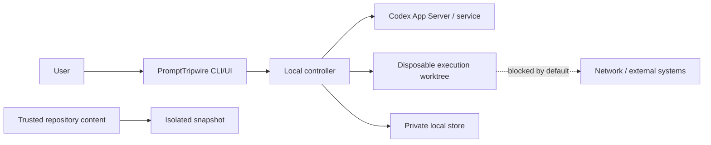

# Security and privacy specification

Status: Required P0 controls verified, including tool-free App Server comparison

Date: 2026-07-15

## 1. Security objective

PromptTripwire reduces accidental scope and side effects from an authorized Codex task. It is not a secure malware-analysis sandbox and must not be presented as one.

The MVP supports repositories the user already trusts enough to inspect with Codex. Unknown or adversarial repositories are out of scope.

## 2. Assets

- source code and uncommitted work;
- API keys, Codex credentials, tokens, and environment secrets;
- user identity and local filesystem data;
- Git history and repository integrity;
- human decisions and execution contracts;
- audit evidence and model/thread identifiers;
- external services, production systems, and billable resources reachable from the machine.

## 3. Trust boundaries

Repository text, model output, tool requests, App Server events, local HTTP requests, and persisted data are untrusted inputs even when their transport is authenticated.

## 4. Threats and controls

| Threat | MVP control | Residual risk |
|---|---|---|
| Probe modifies user's work | Probes use a read-only temporary worktree; original checkout is never CWD | Sandbox/platform defects remain possible |
| Prompt injection in repository instructions | Trusted-repository scope, no network, no project scripts, bounded static inspection, explicit instruction/evidence provenance | Tracked malicious content can still influence model output |
| Explicit Plugin invocation is rediscovered by a child Codex thread | Preserve the task as data but disable Plugin contributions at App Server process startup; retain the re-entry sentinel and repository boundary | Standalone non-Plugin Skills remain discoverable and fail closed if they request out-of-repository reads |
| Secret exposure to model or logs | Snapshot tracked files only, deny common secret paths, minimal environment, redaction, no environment dumps or raw reasoning | A tracked secret in an allowed source file can still be read |
| Command injection | Structured command actions, allowlisted static commands in probes, deny unknown/compound execution | Parser or App Server metadata mismatch |
| Symlink/path escape | Audit every materialized link before a probe thread, canonicalize root/CWD/action paths per approval, deny broken/external/unresolved links, preserve protected path precedence and disposable roots | Platform-specific filesystem races remain between checks |
| Local UI hijack | Loopback bind, random port, per-run capability token, same-origin/CORS/CSP, no remote bind, terminal/archive/30-minute-idle capability closure | Other processes under the same OS user may still access the listener while its capability remains active |
| Contract tampering | Canonical hash, immutable versions, recompute before use, transactional state | Same-user local attacker can alter both program and data |
| Stale approval | Bind to task/snapshot/config/model hashes; invalidate on drift | Undetected external state drift is possible |
| External or production side effect | Network and remote tools disabled; deterministic decision separates implementation intent from operation authority | User can perform a separately authorized action outside the P0 executor |
| Approval confusion | Concrete effects, no high-impact default, expected version/idempotency checks | Human review can still be mistaken |
| Malicious model output or plan omission | Strict schemas plus `deterministic-v2` evaluation of original-task and plan evidence; task-only provenance never claims probe support; model cannot approve | Policy pattern omissions or semantic misclassification |
| Denial of service/cost runaway | Probe/time/token limits, capped concurrency/retry, usage display, cancel | Provider-side cost estimates may be unavailable |
| Audit data leakage | Private OS storage, retention, sanitized export, no telemetry | Local disk is not application-level encrypted |
| Partial change after deviation | Isolated disposable worktree, interrupt, preserve evidence, clean restart | A local write may occur before detection |

## 5. Probe policy

Probe worktrees include only the approved Git snapshot and an explicitly accepted dirty patch. Untracked files are excluded by default.

The probe command policy allows only bounded static inspection needed to understand the repository. Examples may include Git metadata and text search. The actual allowlist must be action-based and tested; this document does not authorize arbitrary `sh -c`, interpreters, project scripts, package managers, builds, tests, or network clients.

The probe process:

- has no network access;
- cannot write the snapshot;
- uses normal-schema `approvalPolicy: "untrusted"` and declines non-inspection command, file-change, and permission requests;
- never uses standalone App Server `command/exec`, because it bypasses turn approvals and read-only sandboxing alone is not a command-class allowlist;
- receives a minimal environment;
- has CPU/time/output limits;
- cannot access arbitrary home-directory paths;
- persists sanitized summaries, not full shell output by default.

Every shared child App Server starts with the pinned `plugins` feature disabled,
so an explicit Plugin name retained in the task does not re-inject installed
Plugin instructions or bundled Skills into planning, comparison, or execution.
This does not disable standalone system, user, or repository Skills. Their
attempts remain untrusted and cannot expand repository reads past the canonical
probe boundary. `CODEX_HOME`, when explicitly present, is retained only in the
App Server process so the same existing login is used; it is excluded from
App Server child commands by `shell_environment_policy.inherit=none`.

Before any probe thread starts, the coordinator walks the materialized worktree
without following symlinked directories. Every symlink must resolve to a
canonical target below the probe root. Broken, external, or unresolvable links
stop the whole batch with `PROBE_CONTAINMENT_VIOLATION`; they are not retried or
treated as a two-probe degraded result. Internal symlinks are permitted only
when their resolved targets remain contained. Every later command approval
repeats canonical containment for the root, command CWD, and structured action
path (including a nonexistent suffix via its nearest existing ancestor), so the
startup audit is not the only path check. Explicit `..` segments,
absolute-path escape, shell expansion or ambiguity in structured CWD/path text,
or missing resolution evidence remains deny-by-default. Structured action type
and path do not make raw command text trusted: the actual command must parse as
one allowlisted static-read program, use only bounded non-executing flags, and
name operands that match the structured action. Before any child command,
PromptTripwire sets `ZDOTDIR` to a fresh empty mode-`0700` directory inside the
disposable App Server runtime root, excluding user-controlled zsh startup files.
Root-owned global zsh startup files such as `/etc/zshenv` and, for `-lc`,
`/etc/zprofile` remain part of the supported macOS host trust boundary.
The exact macOS App Server 0.144.4 envelopes `/bin/zsh -c <structured-command>` and
`/bin/zsh -lc <structured-command>` are accepted only as three tokens, only
when their one inner command independently passes the same tokenizer, and only
when those inner tokens equal the structured action. Other shell/interpreter wrappers,
compound syntax, redirection, the `-` standard-input sentinel, `rg --pre`,
symlink-following `rg -L`/`--follow`, `find -exec`/write predicates, and
command/action mismatch are denied. Default protected-path patterns and all
`.git` metadata are applied to both lexical and canonical targets before direct
content reads. Recursive
content search performs a fail-closed tree walk first: visible protected files
always block it, and hidden protected entries block it when `rg --hidden` or a
positive `--glob`/`-g` inclusion can make them reachable. Negative-only globs do
not broaden hidden reachability. Listing is deliberately narrower than reading: `listFiles` can
return repository-relative names and metadata, including protected path names,
but cannot return their contents. This check has the same filesystem race limit
as other per-action canonical checks. Because App Server can emit an absolute
structured action path, a root-contained absolute path is accepted only after
canonical containment succeeds.

For the pinned App Server's `search.path` metadata, a basename-only value is
accepted only when it uniquely identifies one explicit `rg` operand. Every
explicit search operand is canonicalized and checked separately; one external,
ambiguous, protected, or protected-content-reachable target rejects the whole
command.

If the platform cannot enforce these properties, probing must stop with an actionable error.

The client also inspects started, completed, and failed command/file items plus aggregate diffs; only an explicitly declined item is treated as non-executed. A trusted command can start without a server approval request, so an unexpected action can be detected only after it begins inside the disposable worktree. Reports must preserve that distinction.

## 6. Secrets

### Never persist or display

- `OPENAI_API_KEY` or Codex authentication tokens;
- GitHub, cloud, package-registry, or database credentials;
- cookies, session tokens, private keys, signing materials;
- full process environments;
- authorization headers;
- raw model reasoning.

### Secret-path policy

Default protected patterns include environment files, key/certificate formats, credential directories, Git credential files, cloud CLI config, SSH material, and known package-manager auth files. Protected paths override allowed paths.

Pattern matching is a backstop, not proof that a file is safe. Before export and log persistence, text passes through value-based and pattern-based redaction. Redaction failures are security bugs and block export.

The App Server uses the user's existing Codex CLI login. PromptTripwire does not require an `OPENAI_API_KEY`, expose a credential setting, read Codex auth files, extract tokens, or copy authentication material into another client.

The comparator uses a fresh ephemeral App Server thread in an empty user-only temporary directory. It receives only task text and already validated/sanitized plan artifacts. Its sandbox is read-only with network disabled; MCP, apps, subagents, and other remote surfaces are disabled at process startup; every tool/permission request, tool item, or diff is denied and treated as failure. Structured comparison output is rejected if deterministic sanitization would alter it, so secret-like model output cannot be persisted under a content hash. Invalid output, invalid references, timeout, disconnect, or unavailable authentication never infer approval and never trigger credential extraction from Codex configuration.

## 7. Network and external tools

Network is denied throughout P0 planning and execution. A request to prepare code that would later need it is a blocking decision that must state:

- exact purpose;
- destination host or service;
- read versus write intent;
- credential use;
- expected cost or production impact;
- rollback or compensating action.

The contract schema reserves explicit hosts/actions rather than unrestricted internet access, but the P0 executor is deny-only and never turns those fields into runtime authority. It rejects a contract containing an allowlist policy or high-impact allowed command class before creating a worktree. A review choice may authorize local code changes that prepare a disclosed network or external effect; it cannot perform that effect. MCP/app tools remain disabled. Remote writes, deploy, release, publish, migration application, billing, production operations, and permission expansion require a separate explicitly authorized workflow outside the P0 executor.

P0 does not enable runtime experimental APIs, granular approval, or permission profiles. Any normal-schema permission-expansion request that arrives receives an empty grant and pauses the run. Proactive `request_permissions` support is deferred because Codex 0.144.4 requires the experimental capability for the granular route.

### 7.1 Deterministic evidence integrity

`deterministic-v2` treats the normalized original task as a first-class policy
input in addition to validated plan artifacts. This is a fail-closed backstop
for a model that omits a requested high-impact action. Task evidence is retained
as `task:normalized`; if no plan carries the same trigger, the Decision Inbox
shows no probe as supporting it. The task therefore cannot manufacture the
appearance of independent model consensus or repository evidence.

Policy matching distinguishes a positive dependency change from an
unambiguous declaration that the structured field has no change. Whole-value
forms such as `dependency-free`, `no new dependencies`, `without adding
dependencies`, unchanged/preserved dependencies, and supported Japanese
equivalents do not create a dependency blocker. A contrast clause disables that
exemption so a later positive action remains visible. General negation handling
also prevents a prohibited-operation instruction from becoming a request while
ensuring that one negated clause cannot mask a later positive clause. Unknown
classification remains blocking.

Task vocabulary uses bounded action-and-target pairs for external services; a
service or artifact noun alone is not authority and is not automatically a
mutation. Repository archive/rename, issue transfer, S3 synchronization, and
Slack notification variants still block, whereas a local release-artifact
inspection or checksum verification does not become a publish request. A
GitHub release-artifact download is classified as network access only. For
validated plan command fields, PromptTripwire accepts only shell-free tokenized
forms for deterministic classification. Ambiguous syntax is unknown, and
absolute, parent-traversing, output, or protected-path operands create the
corresponding scope, unknown, or secret evidence.

Repository private/internal visibility changes and ownership transfers are
classified as both `remote_write` and `permission`; main/default
branch-protection changes carry the same two categories. S3 object deletion is
classified as `destructive_data`, `network`, and `remote_write`. The bounded
English and Japanese task patterns require the operation and target rather than
promoting a bare repository, branch, or object-store mention into authority.

## 8. Local UI

- Bind only to loopback.
- Generate a high-entropy capability token for each run.
- Prefer the token in a short-lived URL fragment or secure bootstrap flow rather than persistent query logs.
- Require the token for all API and SSE requests, and same-origin checks for mutations.
- Set restrictive Content Security Policy and frame protection.
- Disable wildcard CORS.
- Escape all task, repository, command, path, and model-provided text.
- Do not render model-provided HTML.
- Do not load third-party scripts, fonts, analytics, or images.
- Expire access when the run leaves `needs_review`, `ready_for_approval`, or `paused`, when it is archived, or after 30 minutes with no authenticated API activity and no active authenticated SSE connection.
- Permit only the current per-run live generation across all local database connections; persist the non-secret generation, never the bearer capability.
- Require every mutation body to remain under the size cap and finish within five seconds, revalidate the lifecycle and generation after the body, and atomically require an unarchived run with the current generation in the persistence transaction.
- Commit a final answer and its draft-contract/ready transition, or its cancel/rerun transition, as one persistence outcome so capability replacement cannot leave a stranded human decision.
- Preserve the v0.1.1 client idempotency fingerprint across the derived atomic outcome; retries remain compatible, while a changed answer with the same key is rejected.

The implemented CLI starts one server on `127.0.0.1` with an OS-assigned port and a 256-bit random capability. The capability is displayed once in the local URL fragment, never persisted or written to structured logs, removed from the browser address after bootstrap, hashed before server comparison, and sent thereafter only in the authorization header. Native `EventSource` is intentionally not used because it cannot attach that header. After bind and lifecycle validation, live issuance atomically advances a non-secret per-run SQLite generation. A replacement changes no run or approval record; an older listener rejects its next authenticated request and closes on bounded polling, including across local processes and controller restarts. The server scopes the capability to one run, validates the exact Host and Origin, requires idempotency and expected-version headers on writes, caps JSON bodies and gives them a five-second deadline, and serves only the bundled static root. Authenticated requests refresh the idle deadline and an authenticated SSE response prevents idle expiry; rejected traffic does neither. Terminal/non-reviewable state, archive, run loss, superseded generation, or 30 minutes idle immediately revokes the capability and closes the listener after the bounded response grace, force-closing any connection that still has not ended. Startup, each request, and each post-body mutation boundary are revalidated; UI-originated decision, defer, approval, reopen, and cancel transactions atomically reject an archived run or stale generation. A final blocking answer, its provenance, draft contract, and ready transition commit together; a cancel/rerun answer and cancelled transition do likewise. A stale generation rolls back the full outcome, while contract approval remains separate and explicit. SSE resolves its initial event before sending headers. Closure is capability revocation only: it never selects a decision, approves a contract, cancels a run, or changes persisted state, and a later explicit review uses a fresh capability. Browser E2E verifies missing/invalid-token rejection, cross-origin mutation rejection, same-origin-only assets, no high-impact default, keyboard-only review/approval/cancel, bounded cards, assistive-technology state text, cross-connection supersession, atomic final-answer races, initial/active SSE run loss, incomplete-body timeout, slow-body archive races, and lifecycle closure without inferred approval.

## 8.1 Codex Plugin adapter

The repo-scoped Plugin is an untrusted caller of the existing local CLI. Its
Skill is explicit-only and does not expose an approval tool, select a decision,
or implement a second policy engine. It passes the task through the existing CLI
argument when requested over standard input, invokes the runtime without a
shell, redacts secret-like output, and returns only the CLI's compact status or
sanitized report. The target checkout is inspected by the existing
`tripwire inspect` path and is never modified by the adapter.

Adapter output redaction covers common provider token formats, authorization
headers, secret-bearing assignments, credential URLs, and private-key blocks.
Every non-empty Basic or Bearer credential in authorization-style output is
redacted regardless of credential length, including short synthetic or
malformed values that must not bypass the last-resort boundary.
The scoped Decision Inbox URL is intentionally preserved because the caller
must hand that capability to the human; it remains governed by the lifecycle,
loopback, and non-persistence controls above.

The adapter requires macOS arm64, the pinned `tripwire` runtime, and a logged-in
Codex CLI. It does not read or require `OPENAI_API_KEY`. A deterministic
`PROMPT_TRIPWIRE_PLUGIN_REENTRY=1` environment flag is propagated in two
stages. The adapter sets it on the PromptTripwire process; the App Server
transport retains that exact non-secret sentinel in its otherwise minimal
process environment and conditionally injects the same exact value into every
App Server child with `shell_environment_policy.set`. The existing
`shell_environment_policy.inherit=none` boundary remains unchanged. Every call
receives only the controller-owned isolated `ZDOTDIR`; no other caller
environment is forwarded, and non-Plugin calls do not inject the flag.
Any Plugin invocation under that flag fails with `REENTRY_BLOCKED`, including
one attempted by the child Codex thread. Missing runtime/login, unsupported
platform, stale/dirty choices, and other CLI failures remain fail-closed. V1
adds no hook, MCP server, hosted backend, or remote write authority.

Before any child thread starts, the shared transport disables Plugin
contributions while preserving the exact task text. This removes the installed
PromptTripwire Skill from child Plugin context before the sentinel would be
needed, and the sentinel remains a separate deterministic rejection layer. The
control is deliberately not described as disabling all Skills.

The caller's shell sandbox is a separate outer boundary from PromptTripwire's
App Server restrictions. Because the thin adapter must start an authenticated
nested `codex app-server`, that outer sandbox can prevent the child from
reaching the model service. The Skill may ask for the normal Codex command
permission to run only the adapter outside the caller shell sandbox. This does
not select a decision, approve a contract, authorize implementation, or grant
the nested executor more capability. PromptTripwire still supplies its own
minimal environment, re-entry sentinel, probe/comparator/executor sandboxes,
tool denial, contract checks, and containment. Denial stops safely. A sanitized
`INSUFFICIENT_VALID_PROBES: request failed` result obtained under the caller
sandbox may be retried at most once through that normal permission path; the
Skill must not suppress the guard, request an API key, or repeatedly escalate.

The release installer can co-install the same adapter with the existing runtime
under a versioned user-local root. It validates the bundled files, platform,
Node, Git, exact Codex version, and login before changing Codex Plugin state.
It invokes only Codex marketplace/plugin add, list, and targeted remove
operations; it never invokes inspect, decision mutation, approval, or execution.
The installed adapter receives a mode-0600 launcher-path record so a custom
user-local prefix does not require another credential or `PATH` setting. That
local path is never printed or included in the release artifact. Uninstall
removes only `prompt-tripwire@prompt-tripwire-local` and removes the
`prompt-tripwire-local` marketplace only when it still points to the owned
versioned install root.

## 9. Contract and approval integrity

- Every decision has a stable ID and expected run state.
- Approval requests include the current contract version and content hash.
- Duplicate responses are idempotent; conflicting responses fail.
- High-impact options are never preselected.
- “Approve all future actions” is not exposed by PromptTripwire.
- Session-wide App Server approval is not used when it would bypass per-action contract matching.
- A contract amendment creates a new version and clean execution worktree.

## 10. Logging and retention

Logs use structured event types and references, not raw payload dumps. User-private file permissions are applied where supported.

Default retention:

- completed/failed/cancelled runs: seven days;
- active/paused runs: until resolved;
- pinned runs: until explicit deletion;
- temporary worktrees: removed after terminal state, with cleanup failure reported.

Deletion removes database references and artifacts. Secure erasure on SSDs is not claimed.

The implemented CLI exposes archive/unarchive as the pinned-retention control, explicit deletion, and expiry purge. Deletion is refused while execution is active or any disposable worktree still has pending cleanup. Idempotency records are run-scoped and cascade with the run; orphaned snapshots and private artifact files are removed only when no remaining run references them.

Recorded judge replay is generated in a private OS temporary directory, contains sanitized synthetic evidence, and is deleted when the replay closes. It calls no model, reads no target repository, and rejects all HTTP mutations. The UI states that replay is recorded and cannot substitute for live integration evidence.

## 11. Incident behavior

On policy-engine crash, App Server disconnect, event sequence corruption, snapshot mismatch, redaction failure, or uncertain approval state:

1. stop accepting new execution approvals;
2. interrupt the active turn if possible;
3. disable external/network capability;
4. persist a sanitized error and last trusted state;
5. mark the run failed or paused, never completed;
6. require explicit recovery or a clean restart.

## 12. Known limitations to disclose

- The MVP is not a hardened boundary against a malicious repository or same-user local attacker.
- Model consensus does not imply correctness or safety.
- Some local changes may be detected after they occur inside a disposable worktree.
- Source code and plan metadata are processed by OpenAI services under the user's account and applicable terms.
- Local audit storage relies on OS account and filesystem protections; it is not independently encrypted.
- macOS is the first verified platform; Linux must be tested, and Windows is initially unsupported.

These limitations must appear in user-facing documentation and the Build Week submission rather than being hidden in implementation notes.
