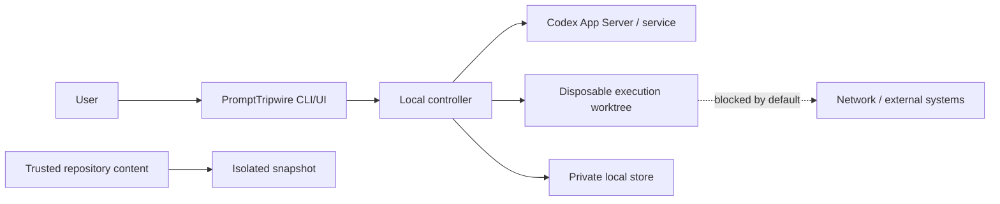

# Security and privacy specification

Status: Required P0 controls verified, including tool-free App Server comparison

Date: 2026-07-15

## 1. Security objective

PromptTripwire reduces accidental scope and side effects from an authorized Codex task. It is not a secure malware-analysis sandbox and must not be presented as one.

The MVP supports repositories the user already trusts enough to inspect with Codex. Unknown or adversarial repositories are out of scope.

## 2. Assets

- source code and uncommitted work;
- API keys, Codex credentials, tokens, and environment secrets;
- user identity and local filesystem data;
- Git history and repository integrity;
- human decisions and execution contracts;
- audit evidence and model/thread identifiers;
- external services, production systems, and billable resources reachable from the machine.

## 3. Trust boundaries

Repository text, model output, tool requests, App Server events, local HTTP requests, and persisted data are untrusted inputs even when their transport is authenticated.

## 4. Threats and controls

| Threat | MVP control | Residual risk |
|---|---|---|
| Probe modifies user's work | Probes use a read-only temporary worktree; original checkout is never CWD | Sandbox/platform defects remain possible |
| Prompt injection in repository instructions | Trusted-repository scope, no network, no project scripts, bounded static inspection, explicit instruction/evidence provenance | Tracked malicious content can still influence model output |
| Secret exposure to model or logs | Snapshot tracked files only, deny common secret paths, minimal environment, redaction, no environment dumps or raw reasoning | A tracked secret in an allowed source file can still be read |
| Command injection | Structured command actions, allowlisted static commands in probes, deny unknown/compound execution | Parser or App Server metadata mismatch |
| Symlink/path escape | Resolve real paths, deny absolute/parent escape, protected path precedence, disposable roots | Platform-specific filesystem races |
| Local UI hijack | Loopback bind, random port, per-run capability token, same-origin/CORS/CSP, no remote bind | Other processes under the same OS user may still access local resources |
| Contract tampering | Canonical hash, immutable versions, recompute before use, transactional state | Same-user local attacker can alter both program and data |
| Stale approval | Bind to task/snapshot/config/model hashes; invalidate on drift | Undetected external state drift is possible |
| External or production side effect | Network and remote tools disabled; deterministic decision separates implementation intent from operation authority | User can perform a separately authorized action outside the P0 executor |
| Approval confusion | Concrete effects, no high-impact default, expected version/idempotency checks | Human review can still be mistaken |
| Malicious model output | Strict schemas plus deterministic policy; model cannot approve | Policy omissions or semantic misclassification |
| Denial of service/cost runaway | Probe/time/token limits, capped concurrency/retry, usage display, cancel | Provider-side cost estimates may be unavailable |
| Audit data leakage | Private OS storage, retention, sanitized export, no telemetry | Local disk is not application-level encrypted |
| Partial change after deviation | Isolated disposable worktree, interrupt, preserve evidence, clean restart | A local write may occur before detection |

## 5. Probe policy

Probe worktrees include only the approved Git snapshot and an explicitly accepted dirty patch. Untracked files are excluded by default.

The probe command policy allows only bounded static inspection needed to understand the repository. Examples may include Git metadata and text search. The actual allowlist must be action-based and tested; this document does not authorize arbitrary `sh -c`, interpreters, project scripts, package managers, builds, tests, or network clients.

The probe process:

- has no network access;
- cannot write the snapshot;
- uses normal-schema `approvalPolicy: "untrusted"` and declines non-inspection command, file-change, and permission requests;
- never uses standalone App Server `command/exec`, because it bypasses turn approvals and read-only sandboxing alone is not a command-class allowlist;
- receives a minimal environment;
- has CPU/time/output limits;
- cannot access arbitrary home-directory paths;
- persists sanitized summaries, not full shell output by default.

If the platform cannot enforce these properties, probing must stop with an actionable error.

The client also inspects completed command/file items and aggregate diffs. A trusted command can start without a server approval request, so an unexpected action can be detected only after it begins inside the disposable worktree. Reports must preserve that distinction.

## 6. Secrets

### Never persist or display

- `OPENAI_API_KEY` or Codex authentication tokens;
- GitHub, cloud, package-registry, or database credentials;
- cookies, session tokens, private keys, signing materials;
- full process environments;
- authorization headers;
- raw model reasoning.

### Secret-path policy

Default protected patterns include environment files, key/certificate formats, credential directories, Git credential files, cloud CLI config, SSH material, and known package-manager auth files. Protected paths override allowed paths.

Pattern matching is a backstop, not proof that a file is safe. Before export and log persistence, text passes through value-based and pattern-based redaction. Redaction failures are security bugs and block export.

The App Server uses the user's existing Codex CLI login. PromptTripwire does not require an `OPENAI_API_KEY`, expose a credential setting, read Codex auth files, extract tokens, or copy authentication material into another client.

The comparator uses a fresh ephemeral App Server thread in an empty user-only temporary directory. It receives only task text and already validated/sanitized plan artifacts. Its sandbox is read-only with network disabled; MCP, apps, subagents, and other remote surfaces are disabled at process startup; every tool/permission request, tool item, or diff is denied and treated as failure. Structured comparison output is rejected if deterministic sanitization would alter it, so secret-like model output cannot be persisted under a content hash. Invalid output, invalid references, timeout, disconnect, or unavailable authentication never infer approval and never trigger credential extraction from Codex configuration.

## 7. Network and external tools

Network is denied throughout P0 planning and execution. A request to prepare code that would later need it is a blocking decision that must state:

- exact purpose;
- destination host or service;
- read versus write intent;
- credential use;
- expected cost or production impact;
- rollback or compensating action.

The contract schema reserves explicit hosts/actions rather than unrestricted internet access, but the P0 executor is deny-only and never turns those fields into runtime authority. It rejects a contract containing an allowlist policy or high-impact allowed command class before creating a worktree. A review choice may authorize local code changes that prepare a disclosed network or external effect; it cannot perform that effect. MCP/app tools remain disabled. Remote writes, deploy, release, publish, migration application, billing, production operations, and permission expansion require a separate explicitly authorized workflow outside the P0 executor.

P0 does not enable runtime experimental APIs, granular approval, or permission profiles. Any normal-schema permission-expansion request that arrives receives an empty grant and pauses the run. Proactive `request_permissions` support is deferred because Codex 0.144.4 requires the experimental capability for the granular route.

## 8. Local UI

- Bind only to loopback.
- Generate a high-entropy capability token for each run.
- Prefer the token in a short-lived URL fragment or secure bootstrap flow rather than persistent query logs.
- Require the token for all API and SSE requests, and same-origin checks for mutations.
- Set restrictive Content Security Policy and frame protection.
- Disable wildcard CORS.
- Escape all task, repository, command, path, and model-provided text.
- Do not render model-provided HTML.
- Do not load third-party scripts, fonts, analytics, or images.
- Expire access when the controller exits or the run is archived.

The implemented CLI starts one server on `127.0.0.1` with an OS-assigned port and a 256-bit random capability. The capability is displayed once in the local URL fragment, never persisted or written to structured logs, removed from the browser address after bootstrap, hashed before server comparison, and sent thereafter only in the authorization header. Native `EventSource` is intentionally not used because it cannot attach that header. The server scopes the capability to one run, validates the exact Host and Origin, requires idempotency and expected-version headers on writes, caps JSON bodies, and serves only the bundled static root. Browser E2E verifies missing/invalid-token rejection, cross-origin mutation rejection, same-origin-only assets, no high-impact default, keyboard-only review/approval/cancel, bounded cards, and assistive-technology state text.

## 8.1 Codex Plugin adapter

The repo-scoped Plugin is an untrusted caller of the existing local CLI. Its
Skill is explicit-only and does not expose an approval tool, select a decision,
or implement a second policy engine. It passes the task through a mode-0600
the existing CLI argument when requested over standard input, invokes the runtime
without a shell, redacts secret-like output, and returns only the CLI's compact status or
sanitized report. The target checkout is inspected by the existing
`tripwire inspect` path and is never modified by the adapter.

The adapter requires macOS arm64, the pinned `tripwire` runtime, and a logged-in
Codex CLI. It does not read or require `OPENAI_API_KEY`. A deterministic
`PROMPT_TRIPWIRE_PLUGIN_REENTRY=1` environment flag is propagated into the
PromptTripwire child process; any Plugin invocation under that flag fails with
`REENTRY_BLOCKED`. Missing runtime/login, unsupported platform, stale/dirty
choices, and other CLI failures remain fail-closed. V1 adds no hook, MCP server,
hosted backend, or remote write authority.

## 9. Contract and approval integrity

- Every decision has a stable ID and expected run state.
- Approval requests include the current contract version and content hash.
- Duplicate responses are idempotent; conflicting responses fail.
- High-impact options are never preselected.
- “Approve all future actions” is not exposed by PromptTripwire.
- Session-wide App Server approval is not used when it would bypass per-action contract matching.
- A contract amendment creates a new version and clean execution worktree.

## 10. Logging and retention

Logs use structured event types and references, not raw payload dumps. User-private file permissions are applied where supported.

Default retention:

- completed/failed/cancelled runs: seven days;
- active/paused runs: until resolved;
- pinned runs: until explicit deletion;
- temporary worktrees: removed after terminal state, with cleanup failure reported.

Deletion removes database references and artifacts. Secure erasure on SSDs is not claimed.

The implemented CLI exposes archive/unarchive as the pinned-retention control, explicit deletion, and expiry purge. Deletion is refused while execution is active or any disposable worktree still has pending cleanup. Idempotency records are run-scoped and cascade with the run; orphaned snapshots and private artifact files are removed only when no remaining run references them.

Recorded judge replay is generated in a private OS temporary directory, contains sanitized synthetic evidence, and is deleted when the replay closes. It calls no model, reads no target repository, and rejects all HTTP mutations. The UI states that replay is recorded and cannot substitute for live integration evidence.

## 11. Incident behavior

On policy-engine crash, App Server disconnect, event sequence corruption, snapshot mismatch, redaction failure, or uncertain approval state:

1. stop accepting new execution approvals;
2. interrupt the active turn if possible;
3. disable external/network capability;
4. persist a sanitized error and last trusted state;
5. mark the run failed or paused, never completed;
6. require explicit recovery or a clean restart.

## 12. Known limitations to disclose

- The MVP is not a hardened boundary against a malicious repository or same-user local attacker.
- Model consensus does not imply correctness or safety.
- Some local changes may be detected after they occur inside a disposable worktree.
- Source code and plan metadata are processed by OpenAI services under the user's account and applicable terms.
- Local audit storage relies on OS account and filesystem protections; it is not independently encrypted.
- macOS is the first verified platform; Linux must be tested, and Windows is initially unsupported.

These limitations must appear in user-facing documentation and the Build Week submission rather than being hidden in implementation notes.
