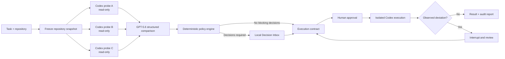

# PromptTripwire product specification

Status: P0 implementation baseline verified

Version: 0.1.4

Date: 2026-07-15

Owner: shuto-S

## 1. Product definition

PromptTripwire is a local-first preflight and execution gate for Codex. Before code is changed, it runs the same task through multiple independent, read-only Codex planning threads. GPT-5.6 converts the resulting structured plans into consensus, divergence, and unknowns. A deterministic policy engine then decides whether the task can proceed, needs human input, or must stop.

The output of review is an immutable, content-addressed execution contract bound to a repository snapshot. The approved Codex run is contained in an isolated worktree and observed for deviations from that contract.

The core promise is:

> Detect implementation-changing ambiguity before it becomes a diff, ask the smallest useful set of questions, and keep execution inside the approved boundary.

## 2. Problem

Coding agents often need to infer missing product and engineering decisions. A single plan does not reveal whether another equally plausible interpretation would:

- change persistent data or public APIs;
- expand the file or service scope;
- introduce a dependency;
- perform an external or irreversible action;
- change security, permission, or compatibility behavior;
- validate success in a materially different way.

Existing plan-review interfaces help a human annotate one plan. Approval and audit tools help govern actions during or after execution. PromptTripwire targets the earlier gap: it obtains multiple repository-grounded interpretations from Codex, shows only consequential disagreements, and carries the chosen interpretation forward as an enforceable contract.

## 3. Goals and non-goals

### 3.1 MVP goals

1. Reveal material differences between plausible Codex implementation plans before any target-repository write.
2. Reduce review load to decision cards backed by traceable evidence.
3. Require confirmation for deterministic high-impact categories even when every model agrees.
4. Bind human choices to an immutable repository snapshot and execution contract.
5. Contain and stop execution when the observed run leaves the approved boundary.
6. Produce a useful local audit record and a visually clear Build Week demo.

### 3.2 Non-goals

- Proving that a consensus plan is correct.
- Replacing code review, tests, static analysis, or security review.
- Making untrusted or malicious repositories safe to execute.
- Operating a hosted multi-tenant control plane.
- Supporting every coding agent in the MVP.
- Automatically choosing high-impact product decisions.
- Guaranteeing prevention of every local file write; the MVP combines sandboxing, approval interception, disposable worktrees, monitoring, and interruption.
- Managing commits, pushes, pull requests, deployments, releases, migrations, or production data without separate explicit authorization.

## 4. Users and primary jobs

### Primary user

An engineer already using Codex for non-trivial repository tasks who wants autonomy without silently delegating ambiguous product or safety decisions.

### Jobs to be done

- “Before Codex implements this issue, show me where another reasonable Codex run would do something materially different.”
- “Ask me only the questions that change scope, behavior, risk, or verification.”
- “After I decide, make sure the implementation run stays within that agreement.”
- “Give me a compact record of what was decided, why, and what Codex actually did.”

## 5. Core workflow



### 5.1 CLI entry points

The intended command surface is:

```text
tripwire inspect --task "..." [--repo PATH] [--terminal]
tripwire inspect --task-file issue.md [--repo PATH] [--terminal]
tripwire replay [--terminal]
tripwire review RUN_ID [--terminal]
tripwire review RUN_ID --decision DECISION_ID (--option OPTION_ID | --freeform TEXT | --defer)
tripwire review RUN_ID (--approve [--contract CONTRACT_ID] | --cancel)
tripwire approve RUN_ID [--contract CONTRACT_ID]
tripwire run --contract CONTRACT_ID [--terminal]
tripwire status RUN_ID
tripwire report RUN_ID [--format json|markdown]
tripwire cancel RUN_ID
tripwire export RUN_ID --output PATH
```

`inspect` never starts an implementation run. `run` requires an approved, current contract.

### 5.2 Hybrid interface

The CLI is the primary surface. A local web UI opens only when review is useful:

- one or more blocking decisions exist;
- the user explicitly requests review;
- an execution deviation pauses the run.

Headless and terminal-only environments use the same decision schema through a terminal renderer. The UI is not a permanent project-management dashboard.

### 5.3 Recorded judge replay

`tripwire replay` opens one bundled, sanitized Decision Inbox example for UI exploration when a live Codex account is unavailable or rate-limited. It is always labeled `recorded` and `read-only`, accepts no mutations, calls no model, executes no command, and touches no target repository. `--terminal` renders the same recorded decision without opening a listener.

Replay is supporting judge evidence only. It cannot satisfy or replace a live probe, comparison, execution, containment, or acceptance-criterion claim.

## 6. Repository snapshot

Every run is bound to a `RepositorySnapshot` containing:

- canonical repository path;
- current commit SHA;
- active branch name, if any;
- submodule SHAs, if present;
- hash of the user-approved dirty patch, if dirty work is included;
- hashes of applicable `AGENTS.md` and PromptTripwire configuration;
- Codex model identifier and reasoning setting;
- normalized task text and task hash;
- creation timestamp and PromptTripwire version.

Default behavior for a dirty checkout is to stop and ask the user to choose one of:

1. inspect the committed snapshot only;
2. include the current dirty patch in the snapshot;
3. cancel.

PromptTripwire must never clean, reset, stash, or overwrite the user's checkout. Probe and execution worktrees are derived from the approved snapshot.

Any snapshot hash change invalidates prior analysis and approval. The user may rerun inspection; a stale contract cannot be forced through with a CLI flag in the MVP.

## 7. Independent Codex probes

### 7.1 Probe invariants

The default probe count is three. Each probe receives:

- the exact same repository snapshot;
- the exact same task text;
- the exact same system/developer instructions;
- the exact same Codex model and reasoning setting;
- the exact same structured plan schema;
- a separate fresh thread with no shared conversation history.

PromptTripwire must not use “security expert,” “minimalist,” or similar role prompts to manufacture disagreement. A later research mode may compare deliberately different perspectives, but its output must not be presented as naturally occurring ambiguity.

### 7.2 Probe containment

- CWD is a temporary worktree containing the approved tracked snapshot.
- Sandbox mode is read-only.
- Network access is disabled.
- Project scripts, interpreters, package managers, build tools, and test commands are denied during planning.
- Only bounded static inspection operations are allowed.
- Probe turns use normal-schema `approvalPolicy: "untrusted"`; PromptTripwire declines command, file-change, and permission requests outside the static-inspection policy.
- Probe execution never uses App Server `command/exec`, because standalone command execution bypasses turn-level approval handling and read-only sandboxing alone does not classify interpreter, build, test, or package-manager intent.
- Completed command/file items and aggregate diffs are still inspected. If an unexpected local action was not presented for approval, it is treated as a deviation detected inside the disposable worktree, not described as prevented.
- Probe timeout defaults to five minutes and is configurable downward or upward.
- Probe concurrency defaults to three and is capped at three for the MVP.

### 7.3 Plan artifact schema

Each `PlanArtifact` must contain:

```text
summary
assumptions[]
intended_behavior[]
files_to_read[]
files_to_change[]
components[]
data_changes[]
public_api_changes[]
dependency_changes[]
commands[]
external_effects[]
permission_changes[]
compatibility_impacts[]
reversibility
verification_steps[]
unknowns[]
repository_evidence[]
```

`repository_evidence` entries reference paths and line spans or repository metadata. They do not contain hidden chain-of-thought. Unknown fields are rejected; missing required fields fail validation.

## 8. Comparison and decision extraction

### 8.1 GPT-5.6 responsibilities

GPT-5.6 receives the task plus validated plan artifacts in a fresh ephemeral Codex App Server thread rooted at an empty disposable directory, not unrestricted tool access. The thread is read-only, has network disabled, declines every tool or permission request, and uses a schema-constrained final response. Structured Outputs must return:

- normalized consensus items;
- materially different alternatives;
- unresolved unknowns;
- affected behaviors, files, data, APIs, commands, and external systems;
- evidence references back to source plan fields;
- a concise suggested question and recommendation, when justified.

The recommendation is advisory. The model cannot mark a deterministic policy trigger as safe or approve execution.

### 8.2 Material divergence

A difference is material if choosing one alternative over another can change at least one of:

- user-visible behavior or acceptance criteria;
- persistent data, migration, or deletion semantics;
- public API, compatibility, or authentication behavior;
- affected repository components or file scope;
- dependency or infrastructure footprint;
- permissions, secrets, or network access;
- external side effects;
- reversibility or rollback path;
- required verification.

Naming, prose ordering, and equivalent implementation details are suppressed unless the user asks to inspect them.

### 8.3 Deterministic policy triggers

The following always require explicit human confirmation, even under unanimous plans:

- data deletion, destructive transformation, or migration application;
- production or shared-environment changes;
- deploy, release, publish, commit, push, or pull-request creation;
- remote writes to GitHub or another service;
- authentication, authorization, identity, secret, or permission changes;
- billing, payments, quotas, or cost-bearing operations;
- network access or installation of a new dependency;
- public API or schema breaking changes;
- irreversible or materially difficult-to-reverse actions;
- expansion beyond the task's approved repository or writable roots.

Unknown classification is fail-closed and becomes a decision.

For P0, confirming one of these effects can authorize only the local code changes that prepare it. It does not authorize PromptTripwire to perform a network, remote-write, deploy, release, migration-application, production-data, billing, credential, or permission-expansion operation. Those runtime effects remain denied and require a separate, explicitly authorized workflow outside the P0 executor.

### 8.4 Question budget

The Decision Inbox shows at most three unresolved decisions per review round. It must never hide additional blocking decisions:

- remaining count is displayed;
- execution remains disabled until all blocking decisions are resolved;
- closely coupled decisions may be grouped only when one answer necessarily determines all grouped outcomes;
- deterministic compatibility findings may use one all-or-none card only when every underlying effect and evidence reference remains visible and the allow option accepts the entire disclosed set;
- low-impact informational differences are available under “Evidence,” not promoted to blocking questions.

No aggregate numeric “risk score” is used in the MVP. Category, impact, reversibility, and evidence are more inspectable than an invented number.

## 9. Decision Inbox

Each decision card contains:

- one concrete question;
- why the decision is required;
- two or three mutually exclusive options, plus a free-form override;
- expected behavioral and technical impact per option;
- affected files, data, APIs, permissions, and external systems;
- which probes support each option;
- repository evidence links;
- deterministic policy triggers, if any;
- an optional recommendation with its rationale;
- “defer/cancel” when no safe decision can be made.

The terminal renderer includes the stable decision and option IDs plus complete `tripwire review` commands. A visible option must be actionable without querying the private database or opening the browser UI.

For a high-impact operational effect, the implementation-only option must state that the local code change may be prepared while the actual operation remains denied by the P0 runtime.

High-impact decisions have no preselected default. Keyboard operation, visible focus, semantic headings, labels, and screen-reader status updates are P0 requirements.

The review sequence is:

1. Task and snapshot summary.
2. Up to three decision cards.
3. Consolidated contract preview.
4. Explicit approval, edit, or cancellation.

Full raw plan artifacts are available through an evidence drawer but are not the default presentation.

## 10. Execution contract

An `ExecutionContract` is immutable after approval. Editing creates a new version. It contains:

```text
contract_id
version
run_id
snapshot_hash
task_hash
approved_goal
approved_behaviors[]
approved_assumptions[]
allowed_components[]
allowed_paths[]
protected_paths[]
allowed_command_classes[]
denied_command_classes[]
network_policy
dependency_policy
data_policy
external_effect_policy
required_checks[]
stop_conditions[]
human_decisions[]
unresolved_non_blocking_unknowns[]
model_versions
created_at
approved_at
content_hash
```

Approval records the timestamp and contract content hash. In the local single-user P0, the private database and OS account boundary identify the approving context; the account name is not copied into the contract or export. This is an audit record, not a cryptographic proof of legal identity.

Contracts and run artifacts are private local data by default. Export to the repository or another path requires an explicit command.

## 11. Execution and deviation handling

### 11.1 Start conditions

Execution can start only when:

- all blocking decisions are resolved;
- the contract is explicitly approved;
- snapshot and task hashes still match;
- Codex and policy versions are recorded;
- the isolated execution worktree was created successfully;
- requested permissions fit the contract.

### 11.2 Runtime boundary

- Execution occurs in a disposable Git worktree on a generated local branch.
- Workspace writes are confined to that worktree and configured writable roots.
- Network and remote tool surfaces remain disabled for all P0 execution turns. Contract policy fields are reserved for a future executor that can safely enforce a narrower capability.
- Command, file-change, permission, MCP/app, and diff events are observed through Codex App Server.
- Approval requests are accepted only when the event is permitted by the current contract.
- P0 never opts into `experimentalApi`, permission profiles, granular approvals, or dynamic tools. Permission expansion is deny-only; if the normal-schema permission request is emitted, the client grants no additional permission.
- The aggregated diff is checked after each completed change item and at turn completion.

The MVP must be explicit about a platform limitation: a permitted command may produce a local file change before the aggregate diff monitor reacts. This is contained in the disposable worktree with network disabled. On detection, PromptTripwire interrupts the turn, declines pending approvals, preserves evidence, and requires a new contract or cancellation. It must not claim the local write was prevented.

### 11.3 Deviations

A deviation includes:

- a changed or newly created path outside `allowed_paths`;
- modification of a `protected_path`;
- a command or permission outside the approved class;
- new network, dependency, data, or external-effect requirements;
- behavior that contradicts a human decision;
- an expected required check being removed or altered without approval;
- snapshot drift during the run.

The state transition is `running -> pausing -> paused`. The UI shows the requested action, contract clause, observed evidence, and choices:

1. reject and continue only if Codex can safely recover;
2. amend the contract and restart from a clean execution worktree;
3. cancel the run.

A contract amendment never resumes from an untrusted partial state in the MVP.

### 11.4 Completion

A run completes only after:

- the Codex turn completed successfully;
- no unresolved deviation remains;
- required checks were run and their actual results recorded;
- the final diff is inside contract scope;
- no commit, push, PR, deploy, release, or migration was performed unless separately and explicitly authorized.

Completion produces a Markdown and JSON report containing decisions, contract hash, model/thread identifiers, observed actions, diff summary, checks, deviations, and remaining unknowns.

## 12. State model

Valid run states are:

```text
created
snapshotting
probing
comparing
needs_review
ready_for_approval
approved
running
pausing
paused
completed
failed
cancelled
stale
```

State transitions are persisted atomically. Restarting the local controller must not turn a paused, failed, or stale run into an executable run.

## 13. Failure behavior

| Failure | Required behavior |
|---|---|
| One probe times out or fails | Retry once. If two valid probes remain, mark analysis degraded and require review. |
| Fewer than two valid probes | Fail closed; no contract can be approved. |
| GPT-5.6 refusal or invalid structured output | Retry once. Then show deterministic diff output and require manual review; no auto-approval. |
| App Server disconnects | Interrupt if possible, mark run failed, and preserve last events. |
| Repository snapshot changes | Mark stale and require a new inspection. |
| Local UI closes | Keep run in review/paused state; do not infer approval. |
| Approval response is lost | Remain unapproved; approvals are idempotent by decision ID. |
| Contract store write fails | Fail closed before execution. |
| Required check cannot run | Record the exact reason and finish as paused or failed, not completed. |
| Usage limit or API outage | Preserve resumable analysis state; never continue with missing evidence. |

## 14. Data retention and privacy

- Default storage uses the OS application-data directory, not the target repository.
- Run directories and files use user-only permissions where supported.
- Default retention is seven days after completion; active, paused, and explicitly pinned runs are retained.
- No telemetry or cloud synchronization is enabled in the MVP.
- The App Server uses the user's existing Codex CLI login. PromptTripwire neither requires a separate OpenAI API key nor reads, copies, or exports Codex credentials.
- Raw model reasoning, environment dumps, and full shell environments are not persisted.
- Export is explicit and warns if task text or evidence may be sensitive.

See `SECURITY.md` for the threat model and known limits.

## 15. Functional requirements

| ID | Priority | Requirement |
|---|---|---|
| FR-001 | P0 | Accept task text or a UTF-8 task file and validate a Git repository. |
| FR-002 | P0 | Create and hash an immutable repository snapshot without modifying the user's checkout. |
| FR-003 | P0 | Run three independent read-only Codex probes against identical inputs. |
| FR-004 | P0 | Validate each probe against the canonical plan schema. |
| FR-005 | P0 | Use GPT-5.6 Structured Outputs to extract consensus, divergence, and unknowns. |
| FR-006 | P0 | Apply deterministic confirmation and denial rules after model comparison. |
| FR-007 | P0 | Render decisions in the local UI and terminal fallback. |
| FR-008 | P0 | Limit each review round to three cards without hiding remaining blockers. |
| FR-009 | P0 | Create immutable, versioned execution contracts with content hashes. |
| FR-010 | P0 | Reject stale contracts. |
| FR-011 | P0 | Start execution only in an isolated worktree and approved sandbox. |
| FR-012 | P0 | Observe App Server item, approval, diff, permission, and completion events. |
| FR-013 | P0 | Interrupt and pause on a contract deviation. |
| FR-014 | P0 | Require a clean restart after contract amendment. |
| FR-015 | P0 | Generate JSON and Markdown audit reports. |
| FR-016 | P0 | Support cancellation, timeout, crash-safe state, and idempotent approval. |
| FR-017 | P0 | Redact secret-like values and never log credentials or raw reasoning. |
| FR-018 | P0 | Bind the local UI to loopback with a per-run capability token. |
| FR-019 | P1 | Allow custom repository policy files. |
| FR-020 | P1 | Export a sanitized review artifact for PR or team discussion. |
| FR-021 | P2 | Add adapters for non-Codex coding agents. |
| FR-022 | P2 | Add historical team policies and shared approvals. |

## 16. Non-functional requirements

- **Safety:** deny by default when classification, state, or snapshot is unknown.
- **Reliability:** persisted states and approvals must be recoverable after controller restart.
- **Latency:** probes run concurrently; the UI streams each phase instead of showing an indefinite spinner. No hard latency claim is made until measured on representative repositories.
- **Cost visibility:** show probe count, selected models, token usage when available, retry count, and a pre-run estimate if the provider exposes one.
- **Portability:** the Build Week MVP supports verified macOS builds with Git, Node.js, and an authenticated Codex CLI. No separate OpenAI API credential is required. Linux is the next target but is not advertised as supported until the same containment and end-to-end suite passes. Windows is out of MVP scope.
- **Distribution:** the macOS arm64 release is a compiled JavaScript/runtime archive with checksum, direct launcher, user-local installer/uninstaller, recorded read-only replay, and a dependency-free safe fixture. Judges do not rebuild the TypeScript source.
- **Runtime:** Node.js 24.15+ LTS and Codex CLI 0.144.4 are the pinned implementation baseline. Node 24.15 is the minimum because the built-in SQLite module reached release-candidate status there. A different Codex version or canonical normal-schema hash fails before probing.
- **Accessibility:** complete decision review and approval with keyboard only; WCAG 2.2 AA contrast target.
- **Observability:** structured local events with stable IDs; no secret values or raw chain-of-thought.
- **Compatibility:** use only methods and fields present in the normal App Server schema over stdio. The schema generator and umbrella CLI command are labeled experimental, so exact CLI version and canonical schema drift checks are mandatory; runtime `experimentalApi` is not allowed for P0.

## 17. Acceptance criteria

| ID | Acceptance criterion |
|---|---|
| AC-001 | Given a clean fixture repository and task, `inspect` produces three schema-valid plan artifacts with distinct thread IDs and the same snapshot/task hashes. |
| AC-002 | During probes, attempted target writes, network access, interpreters, builds, tests, and package-manager commands are denied and the original checkout remains byte-for-byte unchanged. |
| AC-003 | A fixture where plans differ on persistent deletion shows a decision card with alternatives, effects, probe support, and repository evidence. |
| AC-004 | A unanimous plan containing deploy, migration apply, secret/permission change, or remote write still requires explicit confirmation. |
| AC-005 | Equivalent plans with no policy triggers produce a contract preview without a blocking decision. |
| AC-006 | More than three blockers display three cards plus the remaining count; execution stays disabled until every blocker is resolved. |
| AC-007 | Approval creates an immutable contract whose hash changes when any decision or boundary changes. |
| AC-008 | Changing the commit, approved dirty patch, task, instructions, or configuration marks the contract stale and prevents `run`. |
| AC-009 | `run` creates a disposable worktree and never writes to the user's original checkout. |
| AC-010 | A file change outside approved paths causes interruption, a visible deviation, and no completed status. |
| AC-011 | An unapproved network, dependency, permission, or external action is declined and pauses the run. |
| AC-012 | Amending a contract discards the partial execution worktree and restarts from the approved snapshot. |
| AC-013 | A successful run reports real check commands and outcomes, final diff scope, thread/model IDs, decisions, and contract hash. |
| AC-014 | No API key, token, full environment, raw reasoning, or secret fixture value appears in UI output, logs, reports, or exported artifacts. |
| AC-015 | The Decision Inbox is operable by keyboard and announces probe, review, pause, and completion state changes to assistive technology. |
| AC-016 | Killing and restarting the controller preserves paused/unapproved state and cannot accidentally launch execution. |
| AC-017 | The local API listens only on loopback, rejects missing/invalid capability tokens and cross-origin mutations, and loads no third-party runtime assets. |
| AC-018 | One failed probe produces degraded/manual review, fewer than two valid probes block approval, and an unrecoverable GPT-5.6 schema/refusal failure cannot auto-approve. |
| AC-019 | An incompatible Codex App Server version fails before probing with the detected and required versions; duplicate or reordered protocol events cannot duplicate approval or completion. |

## 18. Test strategy

### Unit

- schema validation and canonical hashing;
- plan normalization and equivalence rules;
- deterministic policy table;
- question grouping and pagination;
- contract matching for paths, commands, data, network, and external effects;
- secret redaction and export sanitization;
- state transition guards.

### Integration

- fake App Server JSON-RPC streams for approvals, file changes, command execution, interruption, disconnect, and duplicate events;
- fake App Server schema-constrained comparison fixtures, prohibited-tool requests, invalid schema/reference, retry, timeout, and token-usage notifications;
- Git repositories with clean, dirty, submodule, detached HEAD, renamed file, and snapshot drift cases;
- worktree creation, containment, clean restart, and final diff verification.

### End-to-end

Use small local fixture repositories for:

1. ambiguous account deletion;
2. API compatibility choice;
3. dependency addition;
4. harmless internal refactor with consensus;
5. deliberate out-of-scope file change;
6. attempted network or deploy command;
7. controller crash during approval and execution.

No end-to-end test may use production credentials or a shared environment.

## 19. Requirement traceability

| Requirement | Primary acceptance evidence |
|---|---|
| FR-001 | AC-001 plus task-text/task-file CLI integration tests |
| FR-002 | AC-002, AC-008, AC-009 |
| FR-003 | AC-001, AC-002, AC-018 |
| FR-004 | AC-001, AC-018 |
| FR-005 | AC-003, AC-005, AC-018 |
| FR-006 | AC-004, AC-011 |
| FR-007 | AC-003, AC-015 |
| FR-008 | AC-006 |
| FR-009 | AC-007 |
| FR-010 | AC-008 |
| FR-011 | AC-009 |
| FR-012 | AC-010, AC-011, AC-013, AC-019 |
| FR-013 | AC-010, AC-011 |
| FR-014 | AC-012 |
| FR-015 | AC-013 |
| FR-016 | AC-016, AC-018, AC-019 and the failure-behavior table |
| FR-017 | AC-014 |
| FR-018 | AC-017 |

P1/P2 requirements do not gate the MVP and require acceptance criteria when promoted.

## 20. MVP completion definition

The MVP is complete only when all P0 requirements and AC-001 through AC-019 pass on macOS, the judge can install or run it without rebuilding from source, and a sub-three-minute demo can show:

1. three real Codex probes;
2. one material disagreement;
3. the focused local Decision Inbox;
4. contract approval;
5. an execution deviation being stopped or an approved run completing;
6. the final audit report.

Anything less is a prototype, not a completed PromptTripwire submission.
