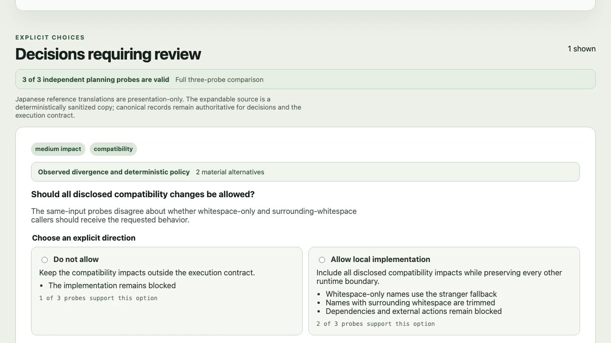
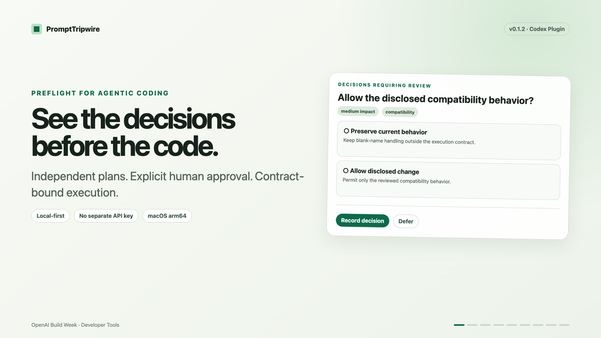

# PromptTripwire v0.1.2 demo

The demo is a v0.1.2 capture. The judge distribution is v0.1.12. Releases v0.1.3 through v0.1.12 improved compatibility, safety, localization, and presentation precision without changing the video's human-approval or contract boundary.

## Issue #43 source preview

v0.1.12 adds judge-facing decision provenance, support counts, and a grouped
contract preview. The repository
contains a 49-second [English-narrated source
preview](../assets/demo/prompt-tripwire-issue-43-source-preview.mp4), its
[captions](prompt-tripwire-issue-43-source-preview.en.srt), and desktop English,
desktop Japanese, mobile Japanese, and contract screenshots under
`docs/assets/demo/`.

This v0.1.12 UI preview is generated from a deterministic safe greeting review
fixture by `npm run capture:issue-43-media`. It is not a live Codex inspect,
execution, or report. The original v0.1.2 demo below remains the canonical live-evidence
recording until a later tagged distribution is intentionally captured. Exact
hashes, dimensions, codecs, and provenance are in
[`issue-43-source-preview.json`](issue-43-source-preview.json).

## Canonical v0.1.2 evidence recording

- Local video: [prompt-tripwire-v0.1.2-demo.mp4](../assets/demo/prompt-tripwire-v0.1.2-demo.mp4)
- English captions: [prompt-tripwire-v0.1.2-demo.en.srt](prompt-tripwire-v0.1.2-demo.en.srt)
- Narration: [NARRATION_v0.1.2.md](NARRATION_v0.1.2.md)
- Live Decision Inbox capture: [decision-inbox-v0.1.2-live.png](../assets/demo/decision-inbox-v0.1.2-live.png)
- Sanitized report scene: [evidence-report-v0.1.2.png](../assets/demo/evidence-report-v0.1.2.png)
- Runtime: 2 minutes 52.862 seconds
- Format: 1920×1080, 30 fps, H.264 video, AAC stereo audio, embedded English `mov_text` subtitles
- Captions: 74 cues; maximum measured rate 19.08 characters per second
- Video SHA-256: `dcc4c8f602ea32ee893a47661316be3a83093ebb46647f08b0e44a0ab4e2f8a7`

## Evidence boundary

The inspection scenes use an API-key-free v0.1.2 run started by explicitly
invoking `prompt-tripwire:preflight` from Codex CLI 0.144.4 against the safe
fixture. Inspection left its source checkout, HEAD, and worktree list unchanged.
The live Decision Inbox capture contains one unresolved compatibility decision,
no dependency blocker, and no selected option or approved contract.

The contract, execution, and report scenes are deliberately disclosed as a
separate safe-fixture run that a human approved earlier. They are not presented
as a continuation of the untouched Inbox capture. The completed report shows
two contract-scoped paths, a passing `npm test`, no deviation, and no remaining
unknown.

All graphics are project-generated and the narration uses a macOS system voice.
The committed media contains no capability token, secret, raw model reasoning,
local absolute path, or third-party runtime asset. The release archive excludes
these media files; the repository copy is a review and offline-playback fallback
for the public YouTube video.

## YouTube copy

Title:

> PromptTripwire — Human Decisions and Contract-Bound Codex Execution

Description:

> PromptTripwire is a local-first preflight and execution gate for Codex.
>
> It runs three independent read-only Codex App Server planning probes against
> the same task and repository snapshot, turns material disagreement into
> explicit human decisions, and executes an approved contract in an isolated
> Codex thread and disposable Git worktree.
>
> Built for the OpenAI Build Week Developer Tools track with codex-cli 0.144.4,
> gpt-5.6-sol planning probes, and a tool-free gpt-5.6-terra comparator.
>
> Repository: https://github.com/shuto-S/prompt-tripwire
> Release (macOS arm64): https://github.com/shuto-S/prompt-tripwire/releases/tag/v0.1.12
>
> This video is the completed v0.1.2 capture. v0.1.12 is the final judge
> distribution to install; the footage is not presented as a v0.1.12 recording.
>
> No separate OPENAI_API_KEY is required. PromptTripwire reuses the logged-in
> Codex CLI / App Server session and never auto-approves human decisions.

The video itself remains the disclosed v0.1.2 capture described above. The
Release line points viewers to the v0.1.12 judge distribution they should
install after publication; it does not represent the footage as a v0.1.12
recording.
